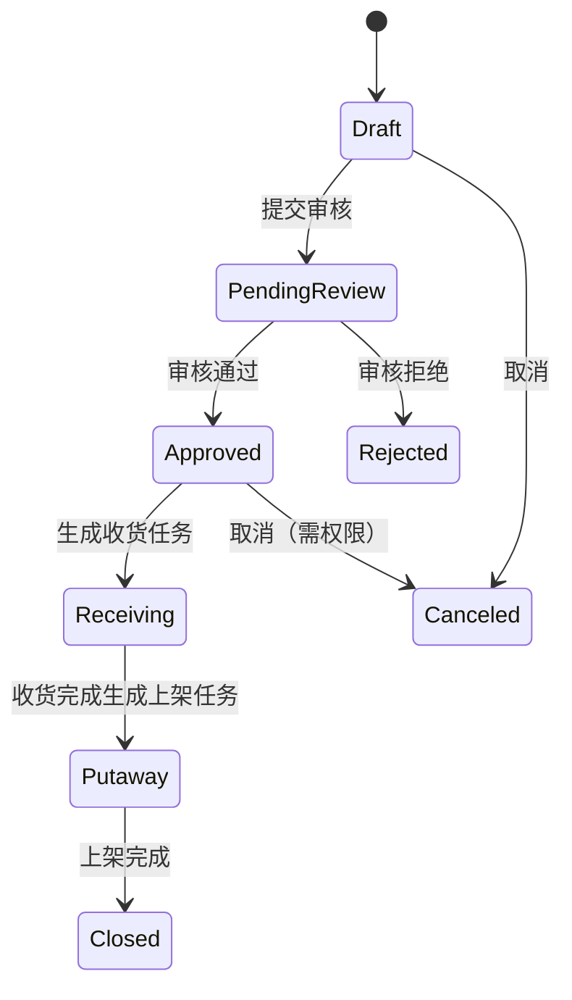
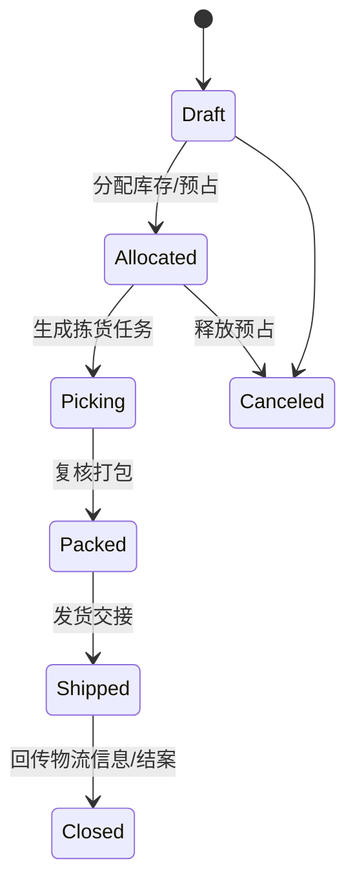
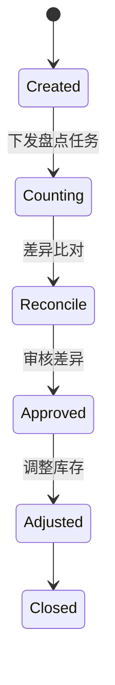
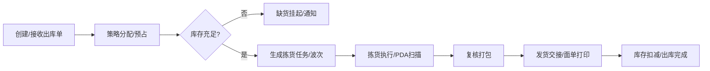
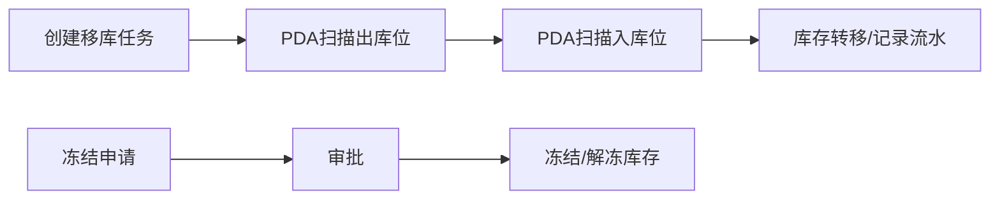
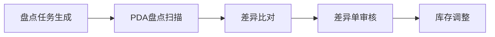
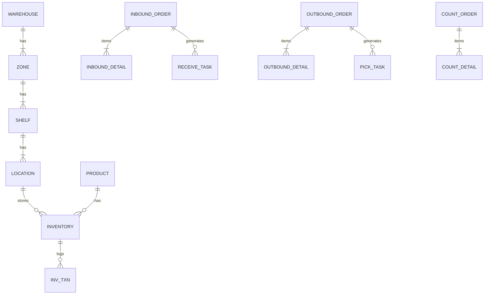

# Underwatch WMS 仓储管理系统
## —— 期末课程设计文档

---

### 课程名称
**J2EE 框架与应用**

### 项目名称
**Underwatch WMS 仓储管理系统**

---

### 学期信息
- 学期：25-26
- 学院：计算机与网络空间安全学院
- 专业：软件工程
- 班级：软工三班

### 学生信息
- 成员：浦颖昊（121052023087）、吴嘉胜（121052023090）

### 指导教师
- 龚平

---

### 完成时间
**2026 年 1 月**

---

### 系统访问地址（已部署）

- 演示环境（IP 访问）：`http://121.41.24.35/` 管理员账号：xzq 密码：123456
- 域名访问：`https://www.pyhuwwms.cn`（备案中）
- 源代码访问：https://github.com/clearpyh/-UnderwatchWMS

### 说明
- 需求分析文档在附录A中，系统界面截图展示位于文档末尾，用于展示运行效果。


## 目录

- [1. 项目概述](#1-项目概述)
  - [1.1 项目功能概要](#11-项目功能概要)
  - [1.2 项目小组分工](#12-项目小组分工)
  - [1.3 系统运行环境及工具介绍](#13-系统运行环境及工具介绍)
  - [1.4-1.7 项目背景、目标、架构与术语约定](#14-项目背景)
- [2. 系统设计](#2-系统设计)
  - [2.1 系统模块设计](#21-系统模块设计)
  - [2.2 系统边界与业务范围（In/Out Scope）](#22-系统边界与业务范围)
  - [2.3 用户模型与权限体系（角色/RBAC/数据隔离）](#23-用户模型与权限体系)
  - [2.4-2.7 领域模型、非功能、典型用例与需求条目](#24-领域模型与关键对象)
- [3. 系统功能设计](#3-系统功能设计)
  - [3.1 核心状态机（入库/出库/盘点）](#31-核心状态机)
  - [3.2 关键业务流程（入库/出库/移库冻结/盘点）](#32-关键业务流程)
  - [3.3 页面与交互设计（摘要）](#33-页面与交互设计摘要)
  - [3.4 API 设计（概要）](#34-api-设计概要)
  - [3.5 编码规则与关键校验](#35-编码规则与关键校验)
- [4. 系统数据库设计](#4-系统数据库设计)
  - [4.1-4.3 设计目标、字段规范与 ER](#41-设计目标与范围)
  - [4.4-4.5 表结构分层、索引与一致性策略](#44-表结构分层摘要)
  - [4.6-4.7 核心表 DDL 与事务并发控制](#46-核心表-ddl摘选)
  - [4.8-4.9 数据字典与合理性说明](#48-数据字典核心字段说明摘选)
- [5. 系统测试设计](#5-系统测试设计)
  - [5.1-5.3 测试目标、环境与策略](#51-测试目标与范围)
  - [5.4 核心功能测试用例（可导入表）](#54-核心功能测试用例可导入表)
  - [5.5 异常与边界（摘要）](#55-异常与边界摘要)
  - [5.6-5.9 缺陷回归、接口要点与一致性验收，关键测试代码摘要](#56-缺陷管理与回归策略摘要)
- [6. 系统实现与运行说明](#6-系统实现与运行说明)
  - [6.1-6.4 部署环境、运行说明与运行要点](#61-系统部署环境)
- [7. 总结与展望](#7-总结与展望)
  - [7.1-7.4 总结、优化建议、展望与课程收获](#71-总结)
- 附录 A uw-wms系统需求分析文档


## 1. 项目概述

### 1.1 项目功能概要
本项目围绕仓储作业的关键链路，完成了以下主要功能模块的实现与验证：
- 仓库管理：仓库结构建模（仓库/库区/货架/库位）、库位规则配置（混放/混批/容量等）。
- 物料管理：SKU 主数据维护（条码、单位、批次管理开关、效期信息等）。
- 入库管理：入库单、审核、收货与质检、上架任务与库位推荐、上架确认。
- 出库管理：出库单、库存分配预占、拣货、复核打包、发货交接与出库结案。
- 库存查询：按 SKU/批次/库位等维度查询与导出，支撑业务核对。
- 用户与权限管理：RBAC 角色权限控制（菜单/按钮/API），支持仓库维度数据隔离与操作审计。

### 1.2 项目小组分工
| 成员 | 分工内容 |
|---|---|
| 浦颖昊 | 前端；后端：仓库模块、产品模块、库存模块 |
| 吴嘉胜 | 前端；后端：客户模块、系统模块 |

### 1.3 系统运行环境及工具介绍
本项目采用前后端分离的 B/S 架构，后端基于 Spring Boot（J2EE 技术体系），前端基于 Vue 技术栈。开发与测试阶段涉及的主要软件与工具如下所示。

表1-1 软件设备要求

| 项目名 | 软件名称 |
|---|---|
| 开发平台 | Windows 11 / Linux（开发）；阿里云/宝塔（部署） |
| 开发工具 | IntelliJ IDEA / VS Code |
| 开发框架 | Spring Boot 3、Spring Security、MyBatis-Plus、Vue 3、Element Plus |
| 行业标准 | RESTful API、JWT、RBAC、HTTPS、MySQL InnoDB、utf8mb4 |
| 浏览器 | Chrome / Edge |
| 测试软件 | Postman（接口验证）；JMeter（可选，性能压测） |

### 1.4 项目背景
在现代供应链体系中，仓储不再只是“存货的场所”，而是连接采购、生产、销售与配送的关键节点。随着 SKU 数量增加、订单碎片化，以及批次与效期管理要求提高，传统人工或半自动仓储管理模式难以同时满足准确性、可追溯性与作业效率等综合目标。因此，构建一套面向企业级场景的仓储管理系统（WMS）具有明显的工程价值与实践意义。

### 1.5 建设目标
本项目目标为实现一套可扩展、可配置、可追溯的 Underwatch WMS 仓储管理系统，具体包括：
- 全流程数字化：覆盖入库、上架、存储、出库、盘点、调拨等核心流程，形成闭环作业。
- 精细化建模：支持多仓库、多库区、多货架、多库位建模，支持 SKU + 批次级库存管理。
- 高效作业：通过上架策略、分配策略与波次拣选策略优化作业路径与效率，提升响应能力。
- 安全与合规：基于 RBAC 的权限控制与操作审计，满足多角色协作与数据隔离需求。
- 开放集成：预留标准 RESTful API，便于与 ERP/TMS/OMS/WCS 等系统集成。

### 1.6 技术架构概述
系统采用 B/S 架构与前后端分离模式，支持 PC 浏览器与 PDA 场景访问：
- 前端：Vue.js 3 + Element Plus（含 HTML/CSS/JavaScript）。
- 后端：Spring Boot 3 + Spring Security（J2EE 技术体系）。
- 持久层：MyBatis-Plus（简化 CRUD 与动态 SQL）。
- 数据库：MySQL 8.0（InnoDB，utf8mb4）。
- 缓存：Redis（热点缓存、分布式锁、幂等控制）。
- Web 服务器：Nginx（静态资源托管与反向代理）。
- 文件存储：支持 OSS（对象存储）与本地磁盘存储的双重模式，具备自动降级与灾备能力。
- RabbitMQ：可选，用于异步削峰与通知类场景。

### 1.7 术语与命名约定（统一口径）
为保证文档一致性与可实现性，本文统一采用以下术语：
- 仓库结构：仓库（Warehouse）→ 库区（Zone）→ 货架（Shelf）→ 库位（Location）。文档中不再使用 Bin 指代库位。
- 批次：Lot Number；效期：Shelf Life。
- 库存口径：
  - 物理库存（On Hand）
  - 冻结库存（Frozen）
  - 预占/分配库存（Allocated）
  - 可用库存（Available）= 物理库存 - 冻结库存 - 预占库存
- 幂等字段：接口层称 requestId，数据库字段为 request_id（两者语义一致，命名不同）。

## 2. 系统设计
### 2.1 系统模块设计
| 模块 | 子功能 | 说明 |
| :-- | :-- | :-- |
| 系统管理 | 用户、角色、权限、参数、日志 | RBAC、按钮/API级权限、操作审计 |
| 基础数据 | 仓库/库区/货架/库位、SKU、客户/供应商、容器 | 编码规则统一、支持批量导入 |
| 入库管理 | 入库单、收货、质检、上架 | 采购/生产/退货入库，库位推荐 |
| 库内管理 | 移库、盘点、冻结/解冻、预警 | 动盘/静盘、差异处理、报警策略 |
| 出库管理 | 出库单、分配、波次、拣货、复核打包、发货 | FIFO/FEFO、按箱/按件、路径优化 |
| 报表与首页 | 运营看板、进销存、周转率、作业效率 | 在线导出、图表化展示 |

### 2.2 系统边界与业务范围
#### 2.2.1 业务范围（In Scope）
- 基础数据：仓库建模（仓库/库区/货架/库位）、SKU 主数据、供应商/客户、容器管理。
- 入库管理：采购入库、生产入库、退货入库、收货质检、上架指引。
- 库内管理：库存查询、移库、盘点（动盘/全盘）、冻结/解冻、库存预警。
- 出库管理：销售出库、生产领料、调拨出库、波次管理、拣货、复核打包、发货交接。
- 策略管理：上架策略、分配策略（FIFO/FEFO/LIFO/指定批次）。
- 报表中心：进销存、作业效率、库存周转率；运营看板。
- 系统管理：用户/角色/权限、操作日志、系统参数、编码规则。

#### 2.2.2 非业务范围（Out of Scope）
- 财务结算（采购付款、销售收款、成本核算）
- 运输调度（车辆路径规划、运费计算）
- 采购执行（供应商寻源、合同管理）
- 销售接单（电商订单聚合、促销管理）

### 2.3 用户模型与权限体系
#### 2.3.1 角色定义
- 平台管理员（ADMIN）：用户管理、参数配置、日志审计。
- 仓库经理（W_MGR）：策略配置、报表查看、关键单据审批（如盘点差异）。
- 产品管理员（P_MGR）：SKU 维护、包装规格、条码规则维护。
- 收货员（RECEIVER）：收货、质检录入、异常上报。
- 上架员（PUTAWAY）：上架执行、库位确认。
- 拣货员（PICKER）：领取拣货任务、扫描拣货、拣货异常上报。
- 复核员（PACKER）：复核打包、装箱、面单打印、发货交接辅助。

#### 2.3.2 权限控制原则
- RBAC：基于角色的访问控制。
- 权限粒度：菜单级、按钮级、API 级鉴权。
- 数据权限：以仓库维度隔离（可扩展货主维度隔离），保证跨仓数据不可见或不可操作。

### 2.4 领域模型与关键对象
库存唯一标识 Key 建议为：仓库 + 库位 + SKU + 批次（必要时可扩展供应商/入库来源信息）。系统通过库存快照表与库存流水表协同保证“可追溯 + 可核对”的数据治理目标。

### 2.5 非功能性需求
- 性能与容量：
  - 并发用户：支持 50+ 仓管员同时在线作业。
  - 吞吐量：支持日均 5,000+ 订单行处理。
  - 响应时间：页面加载 < 1s；PDA 扫描接口 P95 < 500ms。
- 可靠性与可用性：每日全量备份、每小时增量备份；服务异常具备自动恢复能力。
- 安全：JWT 无状态认证、HTTPS 传输加密、敏感字段脱敏展示、密码加盐 Hash 存储。

### 2.6 典型业务用例分析（课程设计视角）
为便于从“需求→设计→实现→测试”的链路进行论证，本文选取若干典型用例进行描述，并在后续章节中给出相应的功能模块、数据结构与测试用例支撑。

#### 2.6.1 用例 UC-01：采购入库与上架
- 参与角色：收货员（RECEIVER）、仓库经理（W_MGR）、上架员（PUTAWAY）。
- 前置条件：SKU 与库位已建模；库位规则（容量/混放/混批）已配置。
- 主成功场景：
  - 收货员创建入库单并提交审核。
  - 仓库经理审核通过，系统生成收货任务。
  - PDA 扫描收货条码并录入质检结论，提交后生成上架任务。
  - 系统按上架策略推荐库位，上架员扫码确认库位并提交，上架完成后库存增加并产生流水。
- 关键约束：条码必须唯一匹配；启用批次管理时批次必填；上架时必须通过容量与混放/混批校验。

#### 2.6.2 用例 UC-02：销售出库（分配→拣货→复核→发货）
- 参与角色：拣货员（PICKER）、复核员（PACKER）、仓库经理（W_MGR）。
- 主成功场景：
  - 创建或接收出库单，系统按分配策略（FIFO/FEFO 等）进行预占分配。
  - 生成拣货任务，拣货员按任务指引扫码拣货并提交。
  - 复核员进行二次扫码复核、装箱与面单打印，完成打包后进入发货交接。
  - 发货确认后库存扣减并记录出库流水，出库单结案。
- 关键约束：分配必须校验可用库存；重复提交需幂等；拣货环节需 SKU+批次二次校验防止错拣。

#### 2.6.3 用例 UC-03：动态盘点与差异调整
- 参与角色：盘点执行人员、仓库经理（W_MGR）。
- 主成功场景：
  - 系统生成盘点任务，下发至 PDA 执行盘点扫描并提交实盘数量。
  - 系统进行差异比对并生成差异记录；差异超阈值时触发二次审核。
  - 审核通过后进行库存调整，并形成完整盘点调整流水，盘点单结案。
- 关键约束：差异审核权限控制；调整必须与流水同事务提交，保证可追溯与可核对。

### 2.7 需求条目清单（便于验收）
为满足课程设计“可验收、可复现”的评分要点，本文将核心需求条目化，后续章节分别给出设计与测试映射。
- R-01：支持仓库结构建模（仓库/库区/货架/库位），库位编码唯一且可读。
- R-02：支持 SKU 主数据维护，支持批次管理开关与效期信息维护。
- R-03：支持入库单创建、审核、收货（含质检）、上架闭环，并产生库存与流水。
- R-04：支持出库单创建、分配预占、拣货、复核打包、发货交接闭环，并完成库存扣减与流水记录。
- R-05：支持库存查询（SKU/批次/库位维度过滤）与导出。
- R-06：支持移库（任务式扫码）并产生移库流水。
- R-07：支持冻结/解冻（含审批流）并保证可用库存口径正确。
- R-08：支持动盘/静盘与差异审核、库存调整闭环。
- R-09：支持 RBAC 权限控制与仓库维度数据隔离，关键操作可审计。
- R-10：满足 PDA 扫描接口 P95<500ms，关键写入具备幂等性与并发一致性控制。


## 3. 系统功能设计

### 3.1 核心状态机
#### 3.1.1 入库单状态机


#### 3.1.2 出库单状态机


#### 3.1.3 盘点单状态机


### 3.2 关键业务流程
#### 3.2.1 入库流程（Receiving & Putaway）


#### 3.2.2 出库流程（Allocation & Picking）


#### 3.2.3 库内移动与冻结


#### 3.2.4 动态盘点（Cycle Count）


### 3.3 页面与交互设计（摘要）
- 系统管理：用户管理、角色权限、参数配置、操作日志检索与导出。
- 仓库建模：仓库/库区/货架/库位树形维护，支持批量导入；库位规则（混放/混批/容量/温层/危化标识）。
- 入库管理：入库单创建/审核/导入/打印；收货任务 PDA 扫描（盲收/按单收）、质检录入、异常上报；上架任务库位推荐与确认。
- 出库管理：出库单创建/导入、分配与缺货处理；波次管理（按订单/商品/库区合并）；拣货任务（单件/整箱）与异常处理；复核打包（二次扫码、装箱、面单打印）；发货交接（承运商接驳、交接单打印）。
- 库存与盘点：库存查询多维过滤与导出；任务式移库；冻结/解冻审批流；盘点差异单生成与处理。
- 报表：运营看板与进销存/周转率/作业效率报表，支持导出。

### 3.4 API 设计（概要）
- 认证与用户：
  - POST /api/auth/login：登录并返回 JWT。
  - GET /api/users；POST /api/users；PUT /api/users/{id}；DELETE /api/users/{id}。
  - GET /api/roles；POST /api/roles；PUT /api/roles/{id}；GET /api/permissions。
- 基础数据：
  - GET /api/warehouses；POST /api/warehouses。
  - GET /api/locations（支持 warehouseId/zone/code 过滤）。
  - GET /api/products；POST /api/products；PUT /api/products/{id}。
- 库存：
  - GET /api/inventories（支持 sku/batch/location/availableOnly 查询）。
  - POST /api/inventories/freeze；POST /api/inventories/unfreeze。
  - POST /api/inventories/move。
- 入库：
  - GET /api/inbound-orders；POST /api/inbound-orders。
  - POST /api/inbound-orders/{id}/approve。
  - POST /api/inbound-orders/{id}/receive（收货明细）。
  - POST /api/inbound-orders/{id}/putaway（上架明细）。
  - GET /api/tasks?type=RECEIVE|PUTAWAY。
- 出库：
  - GET /api/outbound-orders；POST /api/outbound-orders。
  - POST /api/outbound-orders/{id}/allocate。
  - POST /api/outbound-orders/{id}/pick。
  - POST /api/outbound-orders/{id}/pack。
  - POST /api/outbound-orders/{id}/ship。
  - GET /api/tasks?type=PICK|PACK。

### 3.5 编码规则与关键校验
- 编码规则：
  - 库位：{区}-{通道}-{排}-{层}-{格}，示例 A-01-03-05。
  - 入库单：IN{yyyyMMdd}{seq}；出库单：OUT{yyyyMMdd}{seq}；波次：WV{yyyyMMdd}{seq}；盘点单：CT{yyyyMMdd}{seq}。
  - 批次号：LOT-{yyyyMMdd}-{supplierCode}-{seq}；容器/箱号：CT-{seq}、BOX-{seq}。
- 关键校验：
  - 收货：条码唯一匹配；批次管理启用时 batch_no 必填。
  - 上架：库位容量不可超载；混放/混批策略校验。
  - 分配：可用库存校验；预占幂等（requestId）。
  - 拣货：SKU+批次二次校验；少拣/错拣异常流转。
  - 盘点：差异超阈值需二次审核。
  - 审计：记录用户、时间、模块、操作与前后差异摘要。

### 3.6 核心功能实现（关键代码摘要）
为展示系统的技术实现深度，本节选取了**库存扣减**、**文件服务降级**与**跨域安全控制**三个核心场景的关键代码进行展示。

#### 3.6.1 库存扣减与超卖防护
采用数据库事务与内存校验相结合的方式，确保库存扣减的原子性与数据一致性。
```java
// InventoryService.java
@Transactional(rollbackFor = Exception.class)
public void subtract(List<ShipmentOrderDetailBo> shipmentOrderDetailBos) {
    // ... 前置处理 ...
    for (ShipmentOrderDetailBo bo : shipmentOrderDetailBos) {
        // 1. 查询当前库存
        Inventory result = lambdaQuery()
            .eq(Inventory::getWarehouseId, bo.getWarehouseId())
            .eq(Inventory::getSkuId, bo.getSkuId())
            .one();
            
        // 2. 校验库存是否存在
        if (result == null) {
            throw new ServiceException("库存不足：商品不存在");
        }
        
        // 3. 计算扣减后数量
        BigDecimal beforeQuantity = result.getQuantity();
        BigDecimal afterQuantity = beforeQuantity.subtract(bo.getQuantity());
        
        // 4. 校验是否超卖（负库存）
        if (afterQuantity.signum() == -1) {
            throw new ServiceException("库存不足，当前库存: " + beforeQuantity);
        }
        
        // 5. 更新库存
        result.setQuantity(afterQuantity);
        updateList.add(result);
    }
    // 6. 批量执行更新
    updateBatchById(updateList);
}
```

#### 3.6.2 文件服务自动降级（OSS -> Local）
实现了高可用的文件上传策略：优先尝试 OSS 对象存储，若发生异常（如网络中断、服务不可用），自动降级为本地磁盘存储，并自动适配返回路径。
```java
// SysProfileController.java
@Log(title = "用户头像", businessType = BusinessType.UPDATE)
@PostMapping(value = "/avatar", consumes = MediaType.MULTIPART_FORM_DATA_VALUE)
public R<Map<String, Object>> avatar(@RequestPart("avatarfile") MultipartFile avatarfile) {
    if (!avatarfile.isEmpty()) {
        String avatar;
        try {
            // 1. 优先尝试 OSS 上传 (MinIO/Aliyun)
            SysOssVo oss = sysOssService.upload(avatarfile);
            avatar = oss.getUrl();
        } catch (Exception e) {
            // 2. OSS 上传失败，自动降级为本地磁盘存储
            try {
                // 自动拼接当前服务域名，确保前端可访问
                String domain = ServletUriComponentsBuilder.fromCurrentContextPath().build().toUriString();
                avatar = domain + FileUploadUtils.upload(RuoYiConfig.getProfile(), avatarfile);
            } catch (Exception ex) {
                 return R.fail("上传图片异常，请联系管理员");
            }
        }
        // 3. 更新用户资料
        if (userService.updateUserAvatar(LoginHelper.getUsername(), avatar)) {
            return R.ok(Map.of("imgUrl", avatar));
        }
    }
    return R.fail("上传图片异常");
}
```

#### 3.6.3 高优先级 CORS 过滤器
针对前后端分离架构下的跨域问题，采用自定义 Filter 并设置为最高优先级，确保静态资源与 API 接口均能正确响应跨域头。
```java
// ResourcesConfig.java
@Bean
public FilterRegistrationBean<Filter> simpleCorsFilter() {
    Filter filter = new Filter() {
        @Override
        public void doFilter(ServletRequest req, ServletResponse res, FilterChain chain) 
                throws IOException, ServletException {
            HttpServletResponse response = (HttpServletResponse) res;
            HttpServletRequest request = (HttpServletRequest) req;
            
            // 强制写入 CORS 响应头
            response.setHeader("Access-Control-Allow-Origin", request.getHeader("Origin"));
            response.setHeader("Access-Control-Allow-Methods", "POST, GET, OPTIONS, DELETE, PUT");
            response.setHeader("Access-Control-Max-Age", "3600");
            response.setHeader("Access-Control-Allow-Headers", "x-requested-with, authorization, Content-Type, Authorization, credential, X-XSRF-TOKEN");
            response.setHeader("Access-Control-Allow-Credentials", "true");

            if ("OPTIONS".equalsIgnoreCase(request.getMethod())) {
                response.setStatus(HttpServletResponse.SC_OK);
            } else {
                chain.doFilter(req, res);
            }
        }
    };
    // 设置最高优先级，先于 Security 过滤器执行
    FilterRegistrationBean<Filter> bean = new FilterRegistrationBean<>(filter);
    bean.setOrder(Ordered.HIGHEST_PRECEDENCE);
    return bean;
}
```

## 4. 系统数据库设计
### 4.1 设计目标与范围
数据库设计以支撑入库、上架、存储、出库、盘点、移库、冻结等全流程数据管理为目标，兼容多仓库、多货主、多批次模式，重点保证“库存一致性 + 可追溯性 + 可扩展性”。数据库采用 MySQL 8.0 与 InnoDB，引擎字符集 utf8mb4。

### 4.2 命名规范与通用字段
- 表命名：sys_*（系统与权限）、base_*（基础主数据）、wms_*（业务单据）、inv_*（库存与流水）。
- 主键：bigint unsigned（自增或雪花 ID）。
- 通用字段：tenant_id（可选）、warehouse_id、created_at、updated_at、created_by、updated_by、is_deleted、version（乐观锁）。

### 4.3 概念模型（ER）


### 4.4 表结构分层（摘要）
- 系统与权限：sys_user、sys_role、sys_user_role、sys_permission、sys_role_permission、sys_op_log。
- 基础主数据：base_warehouse、base_zone、base_shelf、base_location、base_product、base_customer、base_supplier、base_container。
- 库存与流水：inv_inventory、inv_freeze、inv_move、inv_txn_log。
- 入库业务：wms_inbound_order、wms_inbound_detail、wms_receive_task、wms_putaway_task。
- 出库业务：wms_outbound_order、wms_outbound_detail、wms_pick_task、wms_pack_task、wms_wave、wms_shipment。
- 盘点业务：wms_count_order、wms_count_detail、wms_count_diff。

### 4.5 索引、约束与一致性策略
- 唯一索引：order_no、sku_code、location_code 等业务编码字段。
- 组合索引：（warehouse_id, location_code）、（sku_code, batch_no, location_code）等按查询路径优化。
- 外键策略：在核心链路避免强外键，采用应用层事务保证一致性以提升写入性能与迁移灵活性。
- 乐观锁：inv_inventory 通过 version 参与更新条件，避免并发覆盖。
- 幂等：inv_txn_log 对 request_id 做唯一约束，避免重复入账。

### 4.6 核心表 DDL（摘选）
```sql
CREATE TABLE `inv_inventory` (
  `id` bigint unsigned NOT NULL AUTO_INCREMENT,
  `warehouse_id` bigint unsigned NOT NULL,
  `location_code` varchar(64) NOT NULL,
  `sku_code` varchar(64) NOT NULL,
  `batch_no` varchar(64) NULL,
  `qty_on_hand` int unsigned NOT NULL DEFAULT 0,
  `qty_allocated` int unsigned NOT NULL DEFAULT 0,
  `qty_frozen` int unsigned NOT NULL DEFAULT 0,
  `version` int NOT NULL DEFAULT 0,
  `created_at` datetime NOT NULL DEFAULT CURRENT_TIMESTAMP,
  `updated_at` datetime NOT NULL DEFAULT CURRENT_TIMESTAMP ON UPDATE CURRENT_TIMESTAMP,
  PRIMARY KEY (`id`),
  UNIQUE KEY `uk_inv_key` (`warehouse_id`,`location_code`,`sku_code`,`batch_no`),
  KEY `idx_inv_sku_batch` (`sku_code`,`batch_no`)
) ENGINE=InnoDB DEFAULT CHARSET=utf8mb4;

CREATE TABLE `inv_txn_log` (
  `id` bigint unsigned NOT NULL AUTO_INCREMENT,
  `warehouse_id` bigint unsigned NOT NULL,
  `location_code` varchar(64) NOT NULL,
  `sku_code` varchar(64) NOT NULL,
  `batch_no` varchar(64) NULL,
  `qty_delta` int NOT NULL,
  `biz_type` varchar(32) NOT NULL,
  `biz_no` varchar(64) NOT NULL,
  `request_id` varchar(64) NOT NULL,
  `created_at` datetime NOT NULL DEFAULT CURRENT_TIMESTAMP,
  PRIMARY KEY (`id`),
  UNIQUE KEY `uk_txn_req` (`request_id`),
  KEY `idx_txn_biz` (`biz_type`,`biz_no`)
) ENGINE=InnoDB DEFAULT CHARSET=utf8mb4;
```

### 4.7 事务与并发控制
- 关键写入采用本地事务，保证库存快照与流水一致提交。
- 预占释放流程需幂等，依赖唯一 request_id。
- 高并发扣减采用 Redis 分布式锁或队列化处理，避免超卖与错账。

### 4.8 数据字典（核心字段说明，摘选）
为提升文档的“课程设计可读性与可实现性”，本节对关键数据表的字段含义、约束与典型用途进行说明（仅列出核心字段，通用字段如 created_at/updated_at/is_deleted/version 不再重复展开）。

#### 4.8.1 base_location（库位）
| 字段 | 类型 | 约束/说明 |
|---|---|---|
| warehouse_id | bigint | 必填，所属仓库 |
| zone_code | varchar(32) | 必填，库区编码 |
| shelf_code | varchar(32) | 必填，货架编码 |
| location_code | varchar(64) | 必填且唯一（同仓库内唯一），库位编码 |
| capacity | int unsigned | 必填，库位容量（用于上架校验） |
| allow_mix_sku | tinyint(1) | 必填，是否允许不同 SKU 混放 |
| allow_mix_batch | tinyint(1) | 必填，是否允许同 SKU 不同批次混放 |
| temperature_band | varchar(16) | 可选，温层标识（如冷藏/常温） |

#### 4.8.2 base_product（SKU）
| 字段 | 类型 | 约束/说明 |
|---|---|---|
| sku_code | varchar(64) | 必填且唯一，SKU 编码 |
| name | varchar(128) | 必填，SKU 名称 |
| barcode | varchar(64) | 可选，条码（收货/拣货扫描匹配） |
| unit | varchar(16) | 必填，计量单位（个/箱/托） |
| length_mm/width_mm/height_mm | decimal | 可选，尺寸信息（用于上架策略与容量估算） |
| weight_g | decimal | 可选，重量信息 |
| shelf_life_days | int | 可选，保质期天数（支持 FEFO 逻辑的基础） |
| batch_enabled | tinyint(1) | 必填，批次管理开关 |
| temp_band | varchar(16) | 可选，建议存放温层 |

#### 4.8.3 wms_inbound_order / wms_inbound_detail（入库单与明细）
| 表 | 字段 | 类型 | 约束/说明 |
|---|---|---|---|
| wms_inbound_order | order_no | varchar(64) | 必填且唯一，入库单号（IN{yyyyMMdd}{seq}） |
| wms_inbound_order | warehouse_id | bigint | 必填，所属仓库 |
| wms_inbound_order | type | varchar(16) | 必填，入库类型（采购/生产/退货等） |
| wms_inbound_order | status | varchar(16) | 必填，状态机字段 |
| wms_inbound_detail | line_no | int | 必填，同单据内唯一行号 |
| wms_inbound_detail | sku_code | varchar(64) | 必填，SKU 编码 |
| wms_inbound_detail | batch_no | varchar(64) | 批次启用时必填 |
| wms_inbound_detail | qty_expected | int unsigned | 必填，应收数量 |
| wms_inbound_detail | qty_received | int unsigned | 必填，实收累计数量 |

#### 4.8.4 wms_outbound_order / wms_outbound_detail（出库单与明细）
| 表 | 字段 | 类型 | 约束/说明 |
|---|---|---|---|
| wms_outbound_order | order_no | varchar(64) | 必填且唯一，出库单号（OUT{yyyyMMdd}{seq}） |
| wms_outbound_order | warehouse_id | bigint | 必填，所属仓库 |
| wms_outbound_order | type | varchar(16) | 必填，出库类型（销售/领料/调拨等） |
| wms_outbound_order | status | varchar(16) | 必填，状态机字段 |
| wms_outbound_order | wave_no | varchar(64) | 可选，波次号（用于批量拣货组织） |
| wms_outbound_detail | line_no | int | 必填，同单据内唯一行号 |
| wms_outbound_detail | sku_code | varchar(64) | 必填，SKU 编码 |
| wms_outbound_detail | batch_no | varchar(64) | 可选/策略决定（批次启用时用于分配/拣货校验） |
| wms_outbound_detail | qty_required | int unsigned | 必填，应发数量 |
| wms_outbound_detail | qty_picked | int unsigned | 必填，已拣累计数量 |

#### 4.8.5 inv_inventory / inv_txn_log（库存快照与流水）
| 表 | 字段 | 类型 | 约束/说明 |
|---|---|---|---|
| inv_inventory | warehouse_id/location_code/sku_code/batch_no | 组合键 | 必填且唯一，用于定位库存记录 |
| inv_inventory | qty_on_hand | int unsigned | 必填，物理库存 |
| inv_inventory | qty_allocated | int unsigned | 必填，预占库存 |
| inv_inventory | qty_frozen | int unsigned | 必填，冻结库存 |
| inv_inventory | version | int | 必填，乐观锁版本号 |
| inv_txn_log | qty_delta | int | 必填，本次库存变动增量（可正可负） |
| inv_txn_log | biz_type/biz_no | varchar | 必填，业务类型与业务单号（便于追溯） |
| inv_txn_log | request_id | varchar(64) | 必填且唯一，幂等标识 |

### 4.9 设计合理性说明（轻度论证）
- 一致性：通过“库存快照 + 库存流水 + 本地事务”的组合实现可追溯与可核对，避免仅靠快照导致的追溯困难。
- 并发性：快照表引入 version 乐观锁；高并发场景结合 Redis 锁控制关键写入序列，降低超卖风险。
- 可维护性：表命名按 sys/base/wms/inv 分层，降低理解成本；通用字段统一规范，便于后期审计与扩展。

## 5. 系统测试设计
### 5.1 测试目标与范围
- 验证入库、上架、库存、出库、盘点、移库、冻结/解冻、报表、系统管理等全流程可用性与正确性。
- 重点验证库存一致性（快照与流水）、幂等处理（requestId/request_id）、并发冲突处理、RBAC 权限隔离与审计完整性。
- 满足性能约束：PDA 接口 P95 < 500ms；列表分页默认 20/页且过滤排序正确。

### 5.2 测试环境与数据准备
- 硬件/OS：服务器 CPU≥8核、内存≥16GB、磁盘 SSD；OS：Windows Server 2019 或 Linux（生产建议 Linux）。
- 组件：MySQL 8.0（utf8mb4）、Redis；PDA（Android 9.0+ 或 H5）；浏览器（Chrome/Edge 121+）。
- 测试账号：ADMIN、W_MGR、P_MGR、RECEIVER、PUTAWAY、PICKER、PACKER。
- 测试数据：仓库 BJ01；库位 A-01-03-05（容量100）、A-01-03-06（容量50）；SKU-1001（批次启用）、SKU-2002（批次禁用）；批次 LOT-20260101-SUP01-001 等。

### 5.3 测试类型与策略
- 功能测试：模块级用例覆盖系统管理、基础数据、入库、出库、库内、盘点、报表等关键路径。
- 集成测试：收货→上架→库存；分配→拣货→发货→库存的跨模块链路一致性验证。
- 异常与边界：空值/超长/特殊字符/非法格式、重复提交、并发冲突、网络异常与超时。
- 权限与安全：未登录访问返回 401；越权返回 403；仓库维度数据隔离不穿透；敏感数据不暴露。
- 数据一致性：库存变更与流水同事务提交；预占/冻结/扣减口径一致；幂等约束生效。

### 5.4 核心功能测试用例（可导入表）
| 用例编号 | 功能模块 | 测试点 | 前置条件 | 操作步骤（步骤级） | 预期结果 | 实际结果 | 是否通过 | 优先级 |
|---|---|---|---|---|---|---|---|---|
| UWMS-FT-001 | 系统管理 | 创建用户并分配角色 | 登录ADMIN | 1. 打开用户管理 2. 新建用户u1 3. 分配角色RECEIVER | 用户创建成功；菜单/API权限按角色生效 |  |  | P1 |
| UWMS-FT-002 | 系统管理 | 角色按钮/API授权 | 角色PUTAWAY存在 | 1. 打开角色权限 2. 勾选上架确认按钮与API 3. 保存 | PUTAWAY仅可调用授权API；未授权返回403 |  |  | P1 |
| UWMS-FT-003 | 基础数据 | 创建仓库与库位 | 登录ADMIN | 1. 新建仓库BJ01 2. 新建库位A-01-03-05 3. 新建库位A-01-03-06 | 编码唯一；规则与容量保存正确 |  |  | P1 |
| UWMS-FT-004 | 基础数据 | 创建SKU批次启用 | 登录P_MGR | 1. 新建SKU-1001启用批次 2. 保存 | 批次标志生效；字段校验通过 |  |  | P1 |
| UWMS-FT-005 | 入库 | 入库单创建与审核通过 | 登录RECEIVER或W_MGR | 1. 创建入库单 2. 提交审核 3. 审核通过 | 状态Draft→Approved；生成收货任务 |  |  | P0 |
| UWMS-FT-006 | 入库 | 执行收货并生成上架 | 入库单已Approved | 1. PDA收货扫码SKU/批次 2. 录入质检 3. 提交 | 生成上架任务；入库明细累计正确 |  |  | P0 |
| UWMS-FT-007 | 入库 | 上架推荐与确认 | 上架任务生成 | 1. 接受推荐库位 2. PDA扫码库位 3. 提交 | 容量与规则校验通过；库存增加 |  |  | P0 |
| UWMS-FT-008 | 库存 | 快照与流水一致 | 完成上架 | 1. 查询inv_inventory 2. 查询inv_txn_log | 数量口径一致；唯一键不冲突 |  |  | P0 |
| UWMS-FT-009 | 出库 | 分配策略FIFO | 有可用库存 | 1. 创建出库单 2. 执行分配 | 预占成功；批次按FIFO选择 |  |  | P0 |
| UWMS-FT-010 | 出库 | 拣货二次校验 | 已生成拣货任务 | 1. PDA拣货扫码SKU+批次 2. 提交 | 错拣提示明确；正确拣货可提交 |  |  | P0 |
| UWMS-FT-011 | 出库 | 复核打包与面单 | 已拣货完成 | 1. 二次扫码复核 2. 打包 3. 打印面单 | 复核成功；打印成功；生成交接信息 |  |  | P1 |
| UWMS-FT-012 | 出库 | 发货交接与扣减 | 已打包 | 1. 完成交接 2. 提交发货 | 状态Packed→Closed；库存扣减 |  |  | P0 |
| UWMS-FT-013 | 库内管理 | 任务式移库 | 有库存 | 1. 创建移库任务 2. 扫出/入库位 3. 提交 | 库存转移；流水记录MOVE |  |  | P1 |
| UWMS-FT-014 | 库内管理 | 冻结与解冻 | 有可用库存 | 1. 冻结申请与审批 2. 冻结执行 3. 解冻 | qty_frozen与可用库存口径正确 |  |  | P0 |
| UWMS-FT-015 | 盘点 | 动态盘点差异处理 | 有库存与差异 | 1. 生成任务 2. PDA盘点 3. 差异审核 4. 调整 | 状态机推进正确；调整后账实相符 |  |  | P0 |
| UWMS-FT-016 | 报表 | 看板与报表导出 | 有业务数据 | 1. 打开看板 2. 打开报表 3. 导出 | 统计口径一致；导出成功 |  |  | P2 |
| UWMS-FT-017 | 策略 | 上架同品集中 | 有上架任务 | 1. 配置同品集中 2. 执行上架 | 推荐库位集中；规则校验生效 |  |  | P1 |
| UWMS-FT-018 | 策略 | 分配策略FEFO | 批次含效期 | 1. 配置FEFO 2. 执行分配 | 分配优先即将到期批次 |  |  | P0 |
| UWMS-FT-019 | 系统管理 | 操作日志审计 | 多角色操作过 | 1. 检索日志 2. 导出 | 日志字段完整；可追溯 |  |  | P1 |
| UWMS-FT-020 | 性能 | PDA接口响应SLO | PDA可用 | 1. 连续扫码提交 2. 统计响应 | P95 < 500ms |  |  | P0 |
| UWMS-FT-021 | 编码 | 单号唯一性 | 可创建单据 | 1. 同日创建多单 2. 检查序号 | 编码不重复；冲突拒绝并提示 |  |  | P1 |
| UWMS-FT-022 | 分页 | 服务端过滤排序 | 有大量数据 | 1. 按SKU过滤 2. 按时间排序 | 默认20/页；过滤排序准确 |  |  | P2 |
| UWMS-FT-023 | 权限 | 仓库维度隔离 | 多仓配置 | 1. 仓库A账号查询仓库B数据 | 返回403或空；不穿透 |  |  | P0 |

### 5.5 异常与边界
- 非法输入：未知条码拒绝入账；批次启用但批次为空拒绝提交。
- 空值/超长/特殊字符：字段长度严格校验并返回明确错误信息（如 SKU 名称 > 128）。
- 并发/重复提交：同 requestId 仅首次生效；version 不匹配返回并发冲突并可重试。
- 网络异常/超时：断网提示明确；恢复后重提不重复入账。

### 5.6 缺陷管理与回归策略
- 缺陷等级：阻断（库存错账/越权）、严重（核心流程不可用）、一般、次要。
- 回归触发：库存逻辑、状态机、策略算法、权限与隔离相关改动。

### 5.7 接口测试要点
为便于在验收阶段进行“可复现”的接口验证，本节给出接口测试的检查维度（不依赖具体测试工具）。
- 鉴权校验：未携带 JWT 调用接口返回 401；角色未授权调用返回 403。
- 参数校验：字段必填、类型正确、长度正确；批次启用时 batch_no 必填；不满足条件返回明确错误信息。
- 状态机校验：不允许越级推进或非法回退（例如未 Approved 不可收货；未 Allocated 不可拣货）。
- 幂等校验：对写入类接口携带 requestId，多次提交仅首次生效；后续返回重复请求提示且不重复入账。
- 并发校验：并发更新相同库存记录时，version 不匹配触发并发冲突并可重试或提示用户稍后再试。

### 5.8 数据一致性验收方法（建议）
- 快照与流水核对：随机抽取业务单号（入库/出库/盘点/移库），核对 inv_txn_log 中 qty_delta 的累计与 inv_inventory 中数量变化一致。
- 可用库存口径核对：构造冻结与预占组合场景，验证 Available = OnHand - Frozen - Allocated 的口径保持一致。
- 审计追溯核对：核对 sys_op_log（或操作日志模块）中是否记录关键操作的操作者、时间与字段变化摘要。

### 5.9 关键测试代码摘要
为验证系统的健壮性，项目采用了 JUnit 5 + Mockito 进行单元测试，以下展示了**库存服务业务逻辑**的核心测试用例实现。

#### 5.9.1 InventoryServiceTest（库存业务测试）
通过 `@MockBean` 隔离数据库依赖，重点验证库存查询、新增与更新逻辑的正确性。
```java
// InventoryServiceTest.java
@SpringBootTest(classes = com.ruoyi.RuoYiApplication.class)
@DisplayName("InventoryService业务层测试")
public class InventoryServiceTest {

    @Autowired
    private InventoryService inventoryService;

    @MockBean
    private InventoryMapper inventoryMapper;

    @Test
    @DisplayName("测试查询库存详情")
    public void testQueryById() {
        // Mock 数据
        Long id = 1L;
        InventoryVo vo = new InventoryVo();
        vo.setId(id);
        when(inventoryMapper.selectVoById(id)).thenReturn(vo);

        // 执行调用
        InventoryVo result = inventoryService.queryById(id);

        // 断言验证
        assertNotNull(result);
        assertEquals(id, result.getId());
        // 验证 Mapper 方法是否被正确调用
        verify(inventoryMapper).selectVoById(id);
    }

    @Test
    @DisplayName("测试新增库存")
    public void testInsertByBo() {
        InventoryBo bo = new InventoryBo();
        bo.setSkuId(101L);
        bo.setWarehouseId(201L);
        bo.setQuantity(BigDecimal.TEN);

        when(inventoryMapper.insert(any(Inventory.class))).thenReturn(1);

        inventoryService.insertByBo(bo);

        verify(inventoryMapper).insert(any(Inventory.class));
    }
}
```

#### 5.9.2 InventoryControllerTest（接口层测试）
利用 `MockMvc` 对 API 接口进行模拟请求测试，验证 HTTP 状态码与返回数据的结构。
```java
// InventoryControllerTest.java
@SpringBootTest
@AutoConfigureMockMvc
@DisplayName("InventoryController控制层测试")
public class InventoryControllerTest {

    @Autowired
    private MockMvc mockMvc;

    @MockBean
    private InventoryService inventoryService;

    @Test
    @DisplayName("测试查询库存详细信息")
    public void testGetInfo() throws Exception {
        Long id = 1L;
        InventoryVo vo = new InventoryVo();
        vo.setId(id);
        when(inventoryService.queryById(id)).thenReturn(vo);

        // 模拟 GET 请求并验证响应
        mockMvc.perform(get("/wms/inventory/" + id)
                        .contentType(MediaType.APPLICATION_JSON))
                .andExpect(status().isOk()) // 期望 HTTP 200
                .andExpect(jsonPath("$.data.id").value(id)); // 验证 JSON 响应字段
    }
}
```

## 6. 系统实现与运行说明
### 6.1 系统部署环境
Underwatch WMS 仓储管理系统已完成完整部署，系统采用 B/S 架构，支持通过浏览器直接访问。

- 演示环境（IP 访问）：`http://121.41.24.35/`
- 域名访问：`https://www.pyhuwwms.cn`（备案中）
- 部署方式：云服务器部署
- 操作系统：Linux
- Web 服务器：Nginx
- 后端框架：Spring Boot（J2EE 技术体系）
- 数据库：MySQL
- 前端技术：Vue / HTML / CSS / JavaScript

### 6.2 系统运行说明
用户可通过浏览器访问系统域名进入登录页面，根据不同角色权限登录后，进入对应的功能模块界面，完成仓储管理相关业务操作。

系统支持以下核心功能模块的正常运行：
- 仓库管理
- 物料管理
- 入库管理
- 出库管理
- 库存查询
- 用户与权限管理

### 6.3 系统部署成果说明
本系统已完成从需求分析、功能设计、系统开发、数据库设计到最终部署上线的完整开发流程，具备一定的实用性和扩展价值。

### 6.4 部署架构与运行要点（课程设计补充）
为便于教师检查“系统可运行性”，本节对部署链路进行说明：
- 用户通过浏览器访问系统地址，Nginx 提供静态资源与反向代理能力。
- 前端应用负责页面渲染与业务交互；后端以 RESTful API 提供业务能力与鉴权能力。
- MySQL 存储业务数据；Redis 提供 Token/字典缓存及库存更新的分布式控制能力（按实现配置）。
- **高可用文件服务**：系统集成了 OSS（如 MinIO/阿里云）与本地存储。在 OSS 服务不可用时，系统会自动降级为本地磁盘存储，并自动处理静态资源映射与跨域（CORS）访问，确保头像与附件功能的连续性。

运行注意事项（常见问题定位）：
- 若页面出现“后端接口连接异常”等提示，优先检查后端服务进程状态、Nginx 反向代理配置、后端 API 基础路径与跨域配置。

运行阶段建议关注：
- 日志与审计：关键操作需记录审计日志，便于问题定位与责任追溯。
- 幂等与重试：PDA 场景存在弱网与重复提交，应优先通过 requestId 做幂等控制，避免重复入账。
- 备份与回滚：入库/出库单据与库存流水需可追溯、可重算；建议保留必要的历史数据与索引。

## 7. 总结与展望
### 7.1 总结
本课程设计围绕仓储作业全流程，完成了需求分析、功能设计、数据库设计与测试设计，并实现系统部署上线。系统在工程实现层面重点关注库存一致性、幂等与并发控制、RBAC 权限隔离与操作审计，能够支撑典型仓储业务的日常运行与数据追溯。此外，系统在工程实践中特别强化了**文件服务的健壮性**，实现了 OSS 到本地存储的自动降级机制，有效应对第三方服务抖动风险。

### 7.2 轻度优化与一致性修正（不引入新功能）
- 术语统一：库位统一为 Location，避免 Bin/Location 混用带来的实现歧义。
- 幂等与并发口径明确：接口 requestId 与数据库 request_id 语义一致；库存更新采用 version 乐观锁并在必要处结合 Redis 锁。
- 错误码规范补全建议：建议形成统一错误码枚举与 HTTP 状态码映射，以提升测试可自动化程度与运维可观测性。
- 认证策略说明补全建议：在既有 JWT 认证基础上补充 Token 过期与刷新策略说明，避免运行阶段口径不一致。

### 7.3 展望
在不改变既定业务范围的前提下，后续可进一步细化接口契约（OpenAPI）与测试自动化用例集，并通过性能测试持续优化 PDA 高频扫描场景的响应表现，提升系统稳定性与可维护性。

### 7.4 课程设计收获与不足（总结性补充）
- 收获：
  - 将仓储业务流程抽象为状态机与任务驱动模型，提升了对“流程闭环 + 数据可追溯”的理解。
  - 在库存领域模型中引入快照与流水双表设计，并结合乐观锁与幂等控制，形成较完整的一致性方案。
  - 按 RBAC 将角色、权限与数据隔离分层设计，使得系统具备基础的安全治理能力。
  - 深入理解了**跨域资源共享（CORS）**机制，通过自定义过滤器（Filter）解决了前后端分离架构下的静态资源访问限制问题。
  - 掌握了**服务降级**的设计思想，在文件上传模块实现了从分布式存储到本地存储的平滑切换。
- 不足：
  - 错误码体系与接口契约未做到完全枚举化与标准化，影响自动化测试与运维观测的统一口径。
  - 报表与看板的统计口径仍需进一步固化与验证，避免在数据量提升后出现性能压力与口径漂移。

同时，本课程设计在“需求条目—功能模块—数据结构—测试用例”的对应关系上进行了显式整理，便于教师在验收阶段按条目核对实现与测试证据；后续可进一步补充更细粒度的需求追踪矩阵与接口字段级断言，以提升文档的可检查性与可复现性。


登录界面


找回密码


注册密码


首页

库存统计


入库


出库


移库


盘库


库存记录


往来单位


仓库管理


品牌管理


商品管理


用户管理


角色管理


通知公告


夜间模式


个人中心


# 附录A

# **# Underwatch WMS 仓储管理系统 - 需求分析说明书**

## 1. 引言

### 1.1 编写目的
本文档旨在详细描述 **Underwatch WMS 仓储管理系统** 的功能需求、非功能需求及外部接口需求，明确系统建设目标与验收标准。本文档是系统设计、开发、测试与验收的依据，面向读者包括项目管理人员、软件架构师、开发人员及测试人员。

### 1.2 项目背景
在现代供应链体系中，仓储管理面临 SKU 激增、订单碎片化及批次管理复杂化等挑战。传统的人工或半自动化管理模式在准确性、可追溯性与作业效率方面已难以满足企业级需求。为此，本项目旨在构建一套基于 J2EE 架构的现代化仓储管理系统（WMS），通过全流程数字化管理，实现库存的精细化管控与作业效率的提升。

### 1.3 范围
本系统覆盖仓储管理的以下核心业务：
*   **基础数据**：多仓库建模、SKU 主数据、客户/供应商管理。
*   **入库业务**：收货、质检、上架。
*   **出库业务**：分配、波次、拣货、复核、发货。
*   **库内业务**：移库、盘点、冻结/解冻。
*   **系统管理**：RBAC 权限、操作审计。

### 1.4 术语定义
*   **WMS**：Warehouse Management System，仓储管理系统。
*   **SKU**：Stock Keeping Unit，库存量单位。
*   **PDA**：Personal Digital Assistant，此处指手持射频终端。
*   **RBAC**：Role-Based Access Control，基于角色的访问控制。
*   **FIFO/FEFO**：先进先出 (First In First Out) / 先失效先出 (First Expired First Out)。

---

## 2. 总体描述

### 2.1 用户特征
系统主要面向以下几类用户：
*   **平台管理员 (ADMIN)**：负责系统全局配置、用户账号管理及日志审计，具备最高权限。
*   **仓库经理 (W_MGR)**：负责单体仓库的策略配置（如上架/分配策略）、报表查看及关键单据（如盘点差异）的审批。
*   **收货员 (RECEIVER)**：负责入库环节的实物清点、质检录入与异常上报。
*   **上架员 (PUTAWAY)**：负责将已收货物料按系统指引放置到指定库位。
*   **拣货员 (PICKER)**：根据系统指令在库区进行物料拣选。
*   **复核员 (PACKER)**：负责出库前的二次校验、打包与面单打印。

### 2.2 运行环境
*   **客户端**：PC 端浏览器（Chrome/Edge），PDA 手持终端（Android/H5）。
*   **服务端**：Linux/Windows Server，JDK 17+。
*   **数据库**：MySQL 8.0 (InnoDB, utf8mb4)。
*   **缓存**：Redis 5.0+。

### 2.3 假设与依赖
*   **网络环境**：仓库内部需具备稳定的 WiFi 覆盖，保证 PDA 实时通信。
*   **硬件依赖**：PDA 需支持条码/二维码扫描功能；打印机需支持面单打印指令。
*   **数据隔离**：系统需支持多仓库数据逻辑隔离，不同仓库的操作员不可互访数据。

---

## 3. 功能需求

### 3.1 基础数据管理
#### 3.1.1 仓库建模
*   **描述**：支持多级仓库结构管理（仓库 -> 库区 -> 货架 -> 库位）。
*   **需求点**：
    *   支持库位编码自动生成与校验（唯一性）。
    *   支持库位属性配置：容量限制、混放策略（是否允许不同 SKU 混放）、混批策略。
    *   支持库位温层与用途标记（存储位、暂存位、拣货位）。

#### 3.1.2 物料主数据 (SKU)
*   **描述**：管理所有库存商品的基础属性。
*   **需求点**：
    *   支持 SKU 编码、名称、条码（多条码支持）、单位维护。
    *   **批次管理开关**：决定该 SKU 是否需要强制录入生产日期/批次号。
    *   **效期管理**：维护保质期天数，用于 FEFO 策略计算。

### 3.2 入库管理 (Inbound)
#### 3.2.1 入库单管理
*   **描述**：接收上游系统（ERP）下发或手工创建的入库预期。
*   **需求点**：
    *   支持采购入库、生产入库、退货入库等类型。
    *   包含单据审核流程（Draft -> Pending -> Approved）。

#### 3.2.2 收货与质检 (Receiving)
*   **描述**：依据入库单进行实物清点与质量检查。
*   **需求点**：
    *   支持 PDA 盲收与按单收货。
    *   支持批次号与生产日期录入（若 SKU 启用批次）。
    *   支持质检状态录入（良品/次品），次品自动冻结或生成退货建议。

#### 3.2.3 上架 (Putaway)
*   **描述**：将收货区物料移动至存储位。
*   **需求点**：
    *   **系统推荐**：根据上架策略（同品集中、空闲优先、动线优化）自动推荐目标库位。
    *   **实操确认**：允许上架员修改实际放入的库位，但需校验库位容量与混放规则。

### 3.3 出库管理 (Outbound)
#### 3.3.1 分配与预占 (Allocation)
*   **描述**：根据出库单需求，锁定库存资源。
*   **需求点**：
    *   支持 **FIFO** (先进先出) 与 **FEFO** (先失效先出) 分配策略。
    *   库存不足时支持整单挂起或部分分配。
    *   预占成功后，库存状态变更为 `Allocated`，不可被其他订单使用。

#### 3.3.2 拣货 (Picking)
*   **描述**：指导作业人员从库位取出物料。
*   **需求点**：
    *   支持生成拣货任务单（按单拣货或波次拣货）。
    *   PDA 扫描指引：扫描库位 -> 扫描 SKU -> 确认数量。
    *   强制校验：扫描条码错误或批次不匹配时，系统应阻断并提示。

#### 3.3.3 复核与发货 (Packing & Shipping)
*   **描述**：出库前的最后校验与交接。
*   **需求点**：
    *   支持复核台二次扫码，确保“拣货-发货”一致性。
    *   支持快递面单打印与箱号绑定。
    *   发货确认后，自动扣减库存并回传状态至上游系统。

### 3.4 库内作业
#### 3.4.1 盘点 (Cycle Count)
*   **描述**：核对账面库存与实物库存。
*   **需求点**：
    *   支持动盘（按 SKU/库位/动销率）与全盘。
    *   支持**盲盘**模式（PDA 不显示账面数量）。
    *   差异处理：实盘与账面不一致时生成差异单，需经理审核后方可调整库存。

#### 3.4.2 移库与冻结
*   **需求点**：
    *   支持主动移库（整理库位）与被动移库（上架策略触发）。
    *   支持库存冻结（质检不合格、待报废），冻结后不可分配。

### 3.5 系统管理
*   **用户权限**：基于 RBAC 模型，支持菜单、按钮及 API 级别的权限控制。
*   **操作审计**：记录所有关键业务操作（谁、在什么时候、做了什么、修改前后的值）。

---

## 4. 非功能需求

### 4.1 性能需求
*   **并发能力**：支持至少 50 个并发用户（主要是 PDA 高频操作）。
*   **响应时间**：
    *   WEB 页面加载时间 < 1秒。
    *   PDA 扫描接口响应时间 (P95) < 500毫秒。
*   **吞吐量**：支持日均 5,000+ 订单行处理能力。

### 4.2 安全性需求
*   **认证授权**：采用 JWT (JSON Web Token) 进行无状态认证；强制 HTTPS 传输。
*   **密码安全**：用户密码需加盐 (Salt) 并使用 BCrypt 哈希存储。
*   **跨域安全**：API 接口需配置严格的 CORS 策略，仅允许受信任的域名访问。

### 4.3 可靠性与可用性
*   **数据一致性**：库存扣减需保证强一致性，避免超卖；关键操作（如审核）需支持幂等性。
*   **服务降级**：文件服务（OSS）不可用时，需自动降级为本地存储，保证业务不中断。
*   **备份恢复**：数据库需支持每日全量备份及 Binlog 增量备份。

### 4.4 易用性需求
*   **PDA 适配**：手持端界面需适配 5-7 英寸屏幕，按钮尺寸适宜触控。
*   **错误提示**：报错信息需转化为业务语言（如“库存不足”而非“NullPointerException”）。

---

## 5. 数据需求

### 5.1 关键实体关系 (ER)
*   **仓库 (Warehouse)** 1 : N **库区 (Zone)** 1 : N **货架 (Shelf)** 1 : N **库位 (Location)**
*   **物料 (SKU)** 1 : N **库存 (Inventory)**
*   **库存 (Inventory)** 1 : N **库存流水 (Transaction Log)**
*   **入库单 (Inbound Order)** 1 : N **入库明细** 1 : N **收货任务**

### 5.2 数据字典
*   **库存状态**：`On_Hand` (在库), `Allocated` (预占), `Frozen` (冻结)。
*   **单据状态**：`Draft` (草稿), `Approved` (已审核), `Processing` (作业中), `Completed` (完成), `Closed` (关闭)。

---

## 6. 接口需求

### 6.1 用户接口 (UI)
*   **WEB 端**：基于 Vue3 + Element Plus 设计，风格简洁统一，支持夜间模式。
*   **PDA 端**：大字体、高对比度，重点突出扫描框与数量输入框。

### 6.2 软件接口 (API)
系统对外提供标准 RESTful API，响应格式为 JSON：
*   `POST /api/auth/login`：用户登录
*   `GET /api/inventory`：库存查询
*   `POST /api/inbound`：创建入库单
*   `POST /api/outbound`：创建出库单

### 6.3 硬件接口
*   **扫描枪**：支持 USB/蓝牙 模式接入，模拟键盘输入（以回车键结尾）。
*   **打印机**：支持通过浏览器打印指令调用本地或网络打印机。
