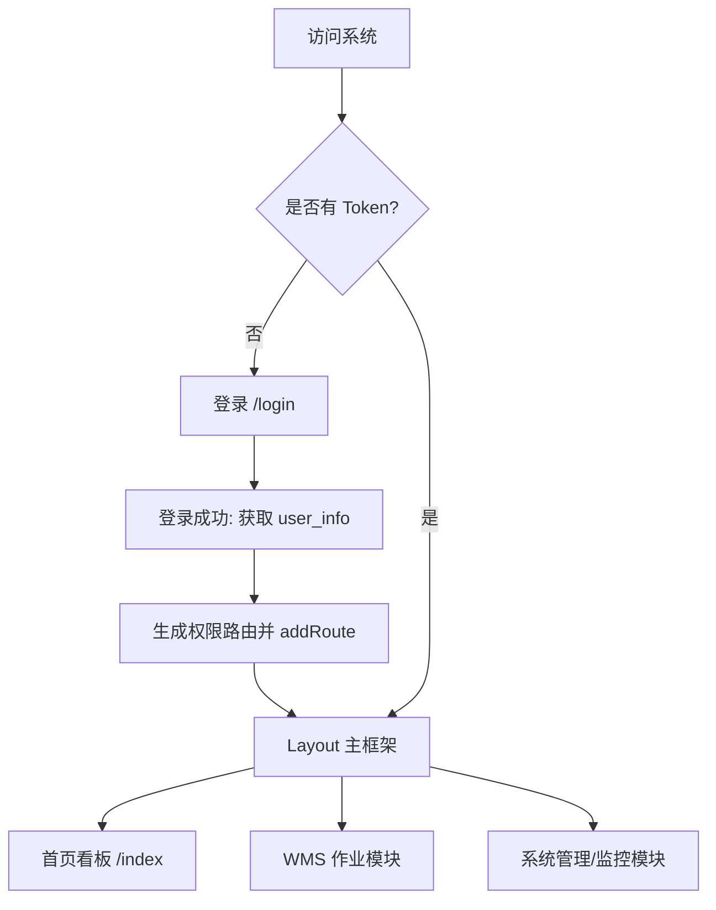
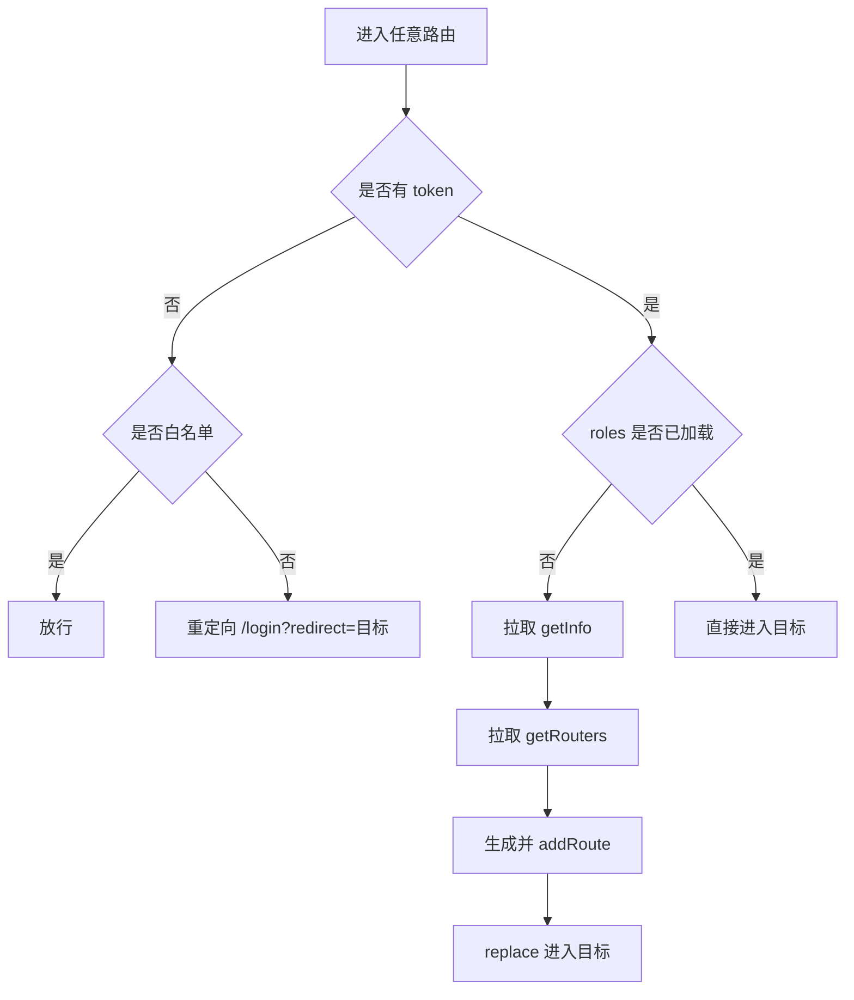
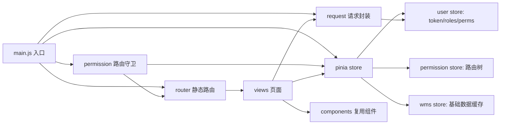

#                    


# UnderWatch 智能仓储管理系统（WMS）

# 前端设计与实现实验报告


## 信息

| 字段 | 内容 |
|---|---|
| 项目名称（中文） | UnderWatch 智能仓储管理系统（WMS） |
| 项目名称（英文） | UnderWatch Intelligent Warehouse Management System (WMS) |
| 课程名称 | Web 前端开发综合实验 / 企业级前端工程实践 |
| 学院 / 专业 / 班级 | 计算机与网络空间安全学院软工三班 |
| 学生姓名 / 学号 | 浦颖昊  121052023087 |
| 指导教师 | 谢国庆 |
| 完成时间 | 2026 年 _1_ 月 |
| 项目访问地址（前端） | http(s)://121.41.24.35 |
| 项目访问地址（后端接口） | http://121.41.24.35:9090 |

---


##   


##   目录

- [第一章 前端页面规划与功能设计](#第一章-前端页面规划与功能设计)
- [第二章 前端页面设计思路与视觉方案](#第二章-前端页面设计思路与视觉方案)
- [第三章 前端页面布局技术实现](#第三章-前端页面布局技术实现)
- [第四章 前端页面开发与实现过程](#第四章-前端页面开发与实现过程)
- [第五章 总结与反思](#第五章-总结与反思)
- [第六章 前端工程架构与模块拆分](#第六章-前端工程架构与模块拆分)
- [第七章 权限模型与安全设计](#第七章-权限模型与安全设计)
- [第八章 性能优化与工程化实践](#第八章-性能优化与工程化实践)
- [第九章 测试验证与打包部署](#第九章-测试验证与打包部署)
- [第十章 结论与展望（完整版）](#第十章-结论与展望完整版)
- [第十一章 关键页面实现细节（按功能拆解）](#第十一章-关键页面实现细节按功能拆解)
- [第十二章 接口联调与数据结构约定](#第十二章-接口联调与数据结构约定)
- [第十三章 交互一致性与可用性设计](#第十三章-交互一致性与可用性设计)
- [第十四章 实验过程记录与问题复盘（详细版）](#第十四章-实验过程记录与问题复盘详细版)
- [附录 核心代码展示（精简 + 职责标注）](#附录-核心代码展示精简--职责标注)

---


# 第一章 前端页面规划与功能设计

## 1.1 项目整体定位说明

UnderWatch 前端定位为企业级仓储控制台：统一登录鉴权、权限菜单、业务单据处理、库存查询、基础资料维护与运维监控入口。

定位依据（源码实现可见附录）：
- 技术栈：Vue3 + Vite + Element Plus + Pinia + Axios（见附录 A1）
- 权限路由：登录后按角色动态加载路由（见附录 A4、A5）
- 业务形态：列表页 + 编辑页 + 状态流转 + 打印（见附录 A7、A8）

## 1.2 项目背景

仓储业务常见痛点：单据流转复杂、角色权限严格、库存需可追溯、操作高频且对效率敏感。本项目通过统一前端控制台将“流程、数据、权限、展示”集中化，提高作业效率与可控性。

## 1.3 项目解决的问题

| 问题 | 传统方式痛点 | 前端解决方案 |
|---|---|---|
| 单据处理低效 | 重复录入、信息分散 | 单据列表/编辑/明细一体化 |
| 权限混乱 | 不同岗位误用功能 | 动态路由 + 权限守卫 |
| 追溯困难 | 库存变化原因不明 | 历史流水/单据关联展示 |
| 交互体验弱 | 反馈慢、误操作多 | 表单校验、状态禁用、统一提示 |

## 1.4 目标用户画像

- 仓库操作员：高频录入与查询，关注“少点几次、少填几次、少报错”。  
- 仓储主管：关注统计、异常与进度，偏“汇总视图 + 可追溯”。  
- 系统管理员：关注账号/角色/菜单/字典/监控，偏“权限可控 + 运维可观测”。  

## 1.5 页面整体规划

页面按三层组织：
- 入口层：登录、注册、错误页
- 框架层：Layout（侧栏 + 顶栏 + 内容承载）
- 业务层：WMS 作业（入库/出库/移库/盘库/库存）+ 系统管理/运维

## 1.6 页面结构与逻辑关系



对应实现：见附录 A4（路由守卫）与 A5（路由结构）。

## 1.7 关键页面内容概要

- 登录页：账号/密码/验证码、记住密码、小猫眼睛跟随交互（见附录 A6）  
- 首页看板：统计卡片 + 通知公告（属于信息总览入口）  
- 入库/出库/移库/盘库：列表筛选 + 状态标签 + 明细展开/编辑 + 打印（见附录 A7、A8）  

## 1.8 核心功能列表（总览）

| 模块 | 核心能力 | 读者看代码建议 |
|---|---|---|
| 登录鉴权 | 登录、验证码、token 注入 | 先看附录 A6、A3 |
| 权限路由 | 动态路由加载与放行控制 | 先看附录 A4、A5 |
| 请求封装 | token、重复提交、统一错误 | 先看附录 A3 |
| 单据列表 | 归一化查询、按需加载明细 | 先看附录 A7 |
| 打印 | 数据映射 → 打印模板输出 | 先看附录 A8 |
| 主题样式 | Token + 玻璃拟态 | 看附录 A2 |

## 1.9 业务边界与非功能性目标（面向仓储场景）

仓储控制台类系统的“好用”并不只等于“页面好看”，更取决于在高频、多人、强权限的真实场景中是否稳定、可控、易用。本项目在前端侧重点关注以下非功能目标：

- 高效：减少无意义跳转与重复输入，常用功能尽量两步可达（如入库、出库、盘点入口靠前）。
- 稳定：统一请求封装，登录过期可感知、可恢复；避免重复提交造成的业务异常。
- 可控：菜单与路由按权限动态生成，用户“看不到”不属于自己的功能，降低误操作概率。
- 可追溯：单据与明细可展开查看，关键字段展示一致（单号、状态、数量、金额、时间）。
- 可扩展：模块化组织（system/monitor/wms），新增业务页可按范式快速落地。

## 1.10 角色与权限视角的功能划分（用户画像落地）

结合 1.4 用户画像，本项目将“同一系统面向不同岗位”的差异性体现在菜单与可操作范围上。典型角色划分如下（示意）：

| 角色 | 主要目标 | 常用入口 | 典型限制 |
|---|---|---|---|
| 仓库操作员 | 快速处理单据 | 入库/出库/移库/盘点、库存查询 | 禁止系统管理；部分删除/作废受单据状态限制 |
| 仓储主管 | 关注进度与异常 | 看板、报表、单据追踪 | 允许查看更多统计，但核心配置仍需管理员 |
| 系统管理员 | 账号与权限可控 | 用户/角色/菜单/字典/参数、监控 | 需要完整权限并具备审计能力 |

说明：前端侧通过动态路由与组件权限指令实现“看得见/点得动”的差异，后端负责真正的鉴权边界。

## 1.11 页面清单（按入口层 / 框架层 / 业务层细化）

为了便于实验检查与后续迭代，本项目将页面按层次梳理如下：

### 1.11.1 入口层页面

- 登录页：账号/密码/验证码、记住密码、忘记密码跳转
- 注册页：用户名/密码确认/验证码、返回登录
- 忘记密码页：账号 + 联系方式 + 验证码 + 新密码闭环
- 错误页：401、404

### 1.11.2 框架层页面

- Layout（主框架）：侧栏、顶栏、面包屑、标签页（如启用）、内容承载
- 首页看板：作为信息聚合入口（统计、通知、快捷入口等）

### 1.11.3 业务层页面（示例）

- WMS 作业：入库、出库、移库、盘点、库存查询
- 系统管理：用户管理、个人中心（资料/头像）、权限与配置类页面
- 运维监控：在线用户、日志、缓存等（是否展示取决于角色）

## 1.12 关键用例（Use Case）与交互闭环

本项目把“能跑通闭环”作为核心验收标准。典型闭环用例如下：

### 1.12.1 用例 A：登录进入系统并加载权限菜单

1. 访问任意业务页面 → 被守卫重定向登录并带 redirect  
2. 登录成功获取 token  
3. 守卫触发：拉取 user_info、拉取菜单路由树  
4. 动态注入路由并 replace 进入目标页  
5. Layout 渲染侧边栏与内容区，用户开始操作

### 1.12.2 用例 B：处理一张单据（以入库为例）

1. 进入入库列表，使用查询条件筛选  
2. 查看列表概要字段（单号/状态/数量等）  
3. 需要明细时展开某行按需加载详情  
4. 根据状态允许的操作执行“编辑/作废/打印”等  
5. 操作成功后刷新列表并给予统一反馈

### 1.12.3 用例 C：找回密码（免登录三段式）

1. 输入账号与邮箱/手机号，发送验证码（后端限流/前端冷却）  
2. 校验验证码并获取 resetToken  
3. 重置密码成功后引导回登录页

## 1.13 约束与假设（实验环境说明）

为保证实验报告与实际运行一致，需要明确以下约束（可按实际情况调整）：

- 前后端分离：前端通过 `/dev-api` 或 `/prod-api` 前缀访问后端服务。
- 权限来源：菜单路由由后端返回；前端只做组件映射与显示控制。
- 打印依赖：打印功能依赖打印插件与模板数据映射，部署环境需保证浏览器打印能力可用。
- 文件上传：头像/图片上传需要后端提供可访问的静态资源地址，否则前端无法回显。

---

# 第二章 前端页面设计思路与视觉方案

## 2.1 风格定位

整体定位为“企业控制台 + 现代化玻璃拟态”：保证信息密度与可读性的同时，使用轻量动效与半透明卡片提升视觉品质。

## 2.2 一致性策略

- 控件一致性：基于 Element Plus（表格/表单/弹窗/按钮）统一交互范式  
- 主题一致性：使用语义 Token（主色、文本、背景）集中定义，页面只消费变量（见附录 A2）  

## 2.3 关键交互设计

- 状态禁用：已入库/作废单据在 UI 层禁用“修改/删除”，减少误操作（见附录 A7）  
- 即时反馈：请求层统一错误提示、401 自动引导重新登录（见附录 A3）  
- 情绪化增强：登录页小猫跟随与轻动效增强记忆点（见附录 A6）  

## 2.4 视觉语言拆解：颜色、层级与密度控制

WMS 控制台属于高信息密度界面，如果色彩与层级不统一，会导致“看不清重点、操作易出错”。本项目的视觉语言强调三点：

### 2.4.1 主色与语义色

- 主色：用于按钮主操作、链接、重点提示（例如 Element Plus 主色）
- 成功/警告/危险：用于状态提示与关键反馈（例如单据状态、校验失败）
- 中性色：用于表格文本、说明文字、边框与分割线

为了避免“每个页面写一套颜色”，本项目将主色与背景等提取到主题 token 中，并让页面尽量消费变量而不是写死色值（见附录 A2）。

### 2.4.2 玻璃拟态的使用边界

玻璃拟态并不是越多越好。本项目把它限定在：
- 顶栏与卡片容器（增强层次）
- 登录/注册入口页（提升观感）

而在列表密集页（例如大量表格）中，玻璃效果会降低对比度，因此更倾向保持清晰的表格背景与边框，使数据可读性优先。

### 2.4.3 信息密度与留白策略

仓储场景需要“信息密度高”，但也必须避免拥挤：
- 查询区：尽量采用多列栅格，让常用条件在一屏内完成
- 表格区：重要列靠前，辅助列可折叠或隐藏
- 弹窗表单：字段分组展示，减少“长表单滚动”

## 2.5 组件规范：按钮、表格、表单的统一交互

### 2.5.1 按钮规范

- 主操作按钮：颜色突出、可见性强（例如“提交/保存/确认”）
- 次操作按钮：颜色弱化（例如“取消/返回/关闭”）
- 危险操作：必须二次确认（例如删除、作废、重置密码）
- 禁用策略：状态不允许时禁用而不是隐藏，提示用户“为什么不能点”（同时后端仍需校验）

### 2.5.2 表格规范

表格是控制台的核心组件，建议统一以下规则：
- loading：请求时显示 loading，避免用户误判“没点上”
- 空状态：统一提示文案与样式
- 分页：统一 Pagination 组件与页码参数
- 行操作：控制数量，更多操作可收纳到下拉菜单

### 2.5.3 表单规范

- 表单校验：必填与格式校验统一使用 Element Plus rules
- 提交反馈：成功提示 + 关闭弹窗 + 刷新列表；失败提示 + 保留用户输入
- 输入体验：password/confirmPassword 提供一致的校验体验，避免反复打断

## 2.6 情绪化元素的“可控引入”

企业控制台通常过于冷冰，本项目在入口层引入小猫动效，但遵循两个边界：
- 不影响业务效率：动效只出现在登录/注册/忘记密码入口层
- 可控性能：使用 rAF 合并事件，避免掉帧

这样既能提升记忆点，又不会让业务页变成“花哨但难用”的界面。

---

# 第三章 前端页面布局技术实现

## 3.1 布局方案

本项目的布局目标是：在“控制台高信息密度”与“多页面一致性”之间取得平衡。总体采用 Flex 为主、配合 fixed/absolute 做局部定位，以保证：
- 主框架在大屏下稳定（侧栏、顶栏固定，内容区滚动）
- 入口页（登录/注册/忘记密码）视觉更自由（背景装饰与卡片叠层）
- 业务页（列表/表单/详情）信息密度更高（表格可读性优先）

### 3.1.1 Layout 主框架（侧栏 + 顶栏 + 内容区）

主框架 Layout 是企业控制台的核心容器，典型结构为：
- 左侧侧栏（Sidebar）：菜单树、折叠/展开
- 顶部顶栏（Navbar）：面包屑、用户入口、主题切换等
- 内容区（AppMain）：router-view 渲染业务页面

布局策略：
- 整体使用 `display: flex` 将侧栏与内容区并排
- 顶栏固定在内容区顶部（高度固定），内容区剩余空间滚动
- 内容区 padding 统一控制，使不同页面保持一致边距与视觉节奏

这样做的好处是：用户在不同业务页之间切换时，导航与操作入口位置不变，减少“找按钮/找入口”的时间。

### 3.1.2 入口页（登录/注册/忘记密码）：装饰层与内容层分离

入口页的布局策略与业务页不同：入口页的主诉求是“聚焦表单 + 风格记忆点”。因此入口页通常拆成两层：
- 背景装饰层：渐变、模糊圆形、浮动形状（absolute 定位 + blur）
- 内容层：左右两列（品牌区 + 表单卡片），用 flex 居中对齐

装饰层与内容层分离的意义：
- 装饰可以自由变化，不影响表单区可读性
- 内容区在不同分辨率下保持居中与稳定宽度

### 3.1.3 业务页（表格/表单）：栅格 + 卡片容器

业务页布局强调“信息结构”，常见组合为：
- 查询区：表单栅格布局（多列对齐，支持折叠）
- 表格区：表格 + 分页 + 工具栏
- 弹窗/抽屉：编辑表单与详情承载

在控制台中，“卡片化容器”能帮助用户快速识别区域边界，但表格密集页不应过度透明，否则会降低对比度，影响可读性。

## 3.2 响应式策略

本项目响应式的目标不是“手机端做得像小程序”，而是在必要时保证“可用”。典型策略是以断点触发移动端模式：
- 桌面端：侧栏固定显示，适合大量菜单与表格操作
- 平板/小屏：侧栏可收起，内容区优先
- 移动端：侧栏抽屉化/覆盖式，避免占用内容空间

### 3.2.1 入口页响应式（登录/注册/忘记密码）

入口页在小屏下的处理原则：
- 左侧品牌区可下移到上方或折叠（优先保证表单可用）
- 表单卡片宽度限制与内边距缩小，避免横向滚动
- 背景装饰层降低强度（opacity/blur），避免干扰输入

### 3.2.2 业务页响应式（表格为主）

表格在移动端可读性天然较弱，因此策略是“能用即可”：
- 查询区折叠为更少行，优先保留高频条件
- 表格列做优先级：关键列保留，辅助列可隐藏/折叠
- 操作按钮收纳到下拉菜单，避免一行塞满

### 3.2.3 统一的间距与断点思路

为了避免“每个页面一个断点”，项目应尽量统一：
- 内容区 padding：在不同断点下取不同值（如 40 → 20）
- 卡片边距：在小屏下减小外边距，让可用空间更多
- 字体层级：标题与正文在小屏下适当缩放，保持信息层级可读

## 3.3 层级与定位：z-index 的统一规则

控制台常见层级包括：
- 背景装饰（最低）
- 页面内容（主层）
- 顶栏/侧栏（固定层）
- 弹窗/抽屉（覆盖层）
- 全局消息（最顶层）

项目中若缺少统一的层级规则，会导致：
- 弹窗被遮挡
- 下拉菜单被内容盖住
- 背景装饰误盖表单

因此建议在样式工程中约定“层级分段”，并尽量复用 Element Plus 默认层级体系，避免自定义过多冲突。

## 3.4 布局可复用范式：列表页与编辑页的统一结构

为了让业务页面“越写越快”，本项目总结出可复用范式：

- 列表页范式：查询区（表单）→ 工具栏（新增/导出）→ 表格 → 分页
- 编辑页范式：基础信息（表单）→ 明细信息（表格/列表）→ 底部操作（保存/提交）
- 详情页范式：只读展示 + 关键字段高亮 + 打印/导出入口

这些范式能减少每个页面从零设计布局的时间，尤其适用于 WMS 这种模块多、页面多的系统。

---

# 第四章 前端页面开发与实现过程

## 4.1 工程落地

本项目的工程落地遵循“先搭骨架、再做规范、最后做业务”的顺序：

1）骨架：main/router/store/permission/request 五件套先跑通  
- 入口（main.js）：注册全局能力与插件  
- 路由（router）：静态路由骨架可访问  
- 状态（Pinia）：用户与权限模块可工作  
- 守卫（permission.js）：未登录重定向、已登录动态路由注入  
- 请求（request.js）：token 注入与错误处理统一

2）规范：确定代码组织与页面范式  
- api 层只做请求，不写 UI  
- views 层负责业务交互  
- components 层沉淀可复用组件（Pagination、ImageUpload 等）

3）业务：按优先级实现 WMS 核心作业页面  
- 入库/出库/移库/盘点优先（高频入口）  
- 再做库存查询与基础资料维护  

对应实现位置：入口与插件见 main.js；请求层见 request.js；权限守卫见 permission.js；路由骨架见 router/index.js（与附录对应）。

## 4.2 应用入口初始化（main.js）：全局能力的集中注册

入口初始化的核心思想是：让业务页面只关心“业务”，公共能力集中注册一次即可。典型集中注册包括：
- 全局方法：字典、时间、下载、表单 reset、树结构处理等
- 全局组件：Pagination、RightToolbar、ImageUpload 等
- 插件安装：Element Plus、打印插件、SVG 图标注册
- 权限守卫：启动全局路由守卫，统一访问控制

这样做的直接收益：
- 业务页面 import 更少、更干净
- 组件/方法使用方式一致，减少团队协作摩擦

## 4.3 请求层封装（request.js）：统一鉴权、错误与重复提交

请求层是企业控制台的“稳定器”。本项目在 request 层集中处理：

### 4.3.1 token 注入与免登录接口

- 默认请求自动携带 `Authorization: Bearer <token>`  
- 对免登录接口（登录、注册、忘记密码等）通过 `headers: { isToken: false }` 明确声明

这种约束能避免“某个页面漏带 token 导致线上随机 401”的问题。

### 4.3.2 重复提交拦截（前端侧体验保护）

对 POST/PUT 的重复提交拦截逻辑可以理解为“短时间幂等保护”：
- 同 url + 同 body + 1 秒内重复 → 直接拒绝并提示

它不能替代后端幂等，但能显著降低用户误操作造成的异常。

### 4.3.3 统一错误处理（401/409/500 等）

请求层统一处理错误码的意义是：业务页不用重复写“过期了怎么跳转、冲突怎么提示”。典型策略：
- 401：弹窗提示并引导重新登录
- 409：业务冲突提示 detailMessage（便于定位问题）
- 403：产品取舍（本项目选择静默，避免刷屏）
- 其他：统一提示“请求失败/系统异常”

## 4.4 登录鉴权实现（核心链路）

## 4.2 登录页实现（核心）

登录实现可以拆为“表单校验、接口调用、token 持久化、路由回跳”四个阶段：

### 4.4.1 表单校验与提交控制

- 使用 Element Plus 表单 rules 进行必填校验  
- 提交按钮在请求中显示 loading  
- 登录失败保留账号输入并刷新验证码（若启用）

### 4.4.2 登录接口调用与 token 存储

登录成功返回 token，前端通过 user store 统一写入 token（并同步到缓存工具中），后续请求由 request 层自动注入。

### 4.4.3 redirect 回跳（用户体验关键）

路由守卫把目标页记录在 `redirect` 中，登录成功后优先回到用户原本想去的页面，避免用户再次手动寻找入口。

### 4.4.4 登录页动效：工程化实现的示例

小猫眼睛跟随采用 rAF 合并事件并通过 transform 位移。这一实现体现了“入口页动效也要工程化”的原则：动效必须可控，不得拖慢交互与输入。

实现片段见附录 A6。

## 4.3 权限与动态路由（核心）

权限与动态路由是企业控制台的核心能力。本项目的关键点是把“访问控制”集中到路由守卫，把“菜单与路由”交给 permission store 生成。

### 4.3.1 守卫的单入口控制

- 无 token：只允许白名单页面（登录/注册/忘记密码/错误页），否则重定向到登录并带 redirect
- 有 token：允许进入业务页；若 roles 未加载，先拉取用户信息与路由树再进入目标页

### 4.3.2 动态路由注入（addRoute）

动态路由注入的关键是把后端返回的 route 结构转换为可渲染的组件：
- Layout/ParentView/InnerLink 等特殊组件单独处理
- 普通页面组件通过 `import.meta.glob` 从 views 中映射

### 4.3.3 菜单的“业务化重排”

本项目在 permission store 内对后端菜单做了二次加工（隐藏/提取/重排），目的不是“改后端”，而是让前端入口更贴合操作员使用习惯（高频入口更靠前）。

实现片段见附录 A4、A5。

## 4.4 WMS 作业页面（以入库为例）

WMS 作业页面的设计目标是：高频、少错、快。以入库为例，页面实现通常包含以下工程化细节：

### 4.4.1 查询归一化：让筛选语义与后端一致

前端常用 `-1/-2` 表示“全部”，但后端通常用 null/不传表示“不筛选”。因此在发请求前做归一化能显著减少“筛选条件导致查不到数据”的误会。

### 4.4.2 明细按需加载：降低首屏负载

列表首屏只加载概要字段，用户展开某行才请求明细，带来的收益：
- 首屏接口更少
- 表格渲染更快
- 后端压力更低

### 4.4.3 状态驱动禁用：降低误操作

单据状态是仓储系统的“硬规则”。前端把状态映射到按钮禁用：
- 已完成/作废：禁用编辑/删除
- 处理中：允许部分操作

这能减少误操作，但后端必须仍然做状态机校验，保证安全边界。

## 4.5 打印能力

核心是“数据映射”：把后端单据结构转为打印模板输入对象，再调用打印插件输出（见附录 A8）。

### 4.5.1 为什么打印要做“数据映射”

打印模板需要的数据结构往往与后端返回的结构不同（字段命名、表体结构、合计字段等）。如果直接把后端对象塞给模板，会导致：
- 模板对后端结构耦合过深
- 后端字段变动引发大面积打印错误

因此本项目采用“映射层”的方式：
- 后端对象 → 统一映射为 printData
- printData → 模板渲染输出

这样模板只依赖 printData 的稳定字段，后端结构变动只需要改映射层，维护成本更低。

### 4.5.2 打印的可扩展方向

后续可进一步扩展：
- 模板配置化（不同客户不同模板）
- 打印字段可选（操作员按需选择）
- 打印预览与历史（便于追溯）

---

# 第五章 总结与反思

## 5.1 完成情况

本项目以“企业级仓储控制台”为目标，在实验周期内完成了从入口到业务的可运行闭环，并形成较为清晰的工程结构与可复用的页面范式。整体完成情况可从“系统骨架、业务闭环、工程化能力、可扩展性”四个维度总结。

### 5.1.1 系统骨架（入口与主框架）

- 入口层页面：登录、注册、忘记密码、401/404 错误页，形成完整的“进入系统 → 处理异常 → 退出/回跳”的入口闭环。
- 主框架 Layout：侧栏菜单、顶栏用户入口、内容区承载，保证所有业务页面的导航一致性与可达性。
- 权限守卫：未登录统一重定向登录并带 redirect；登录后首次进入自动拉取用户信息与菜单路由树，动态注入路由。

### 5.1.2 业务闭环（以 WMS 作业为核心）

WMS 业务页面遵循“查询 → 列表 → 明细 → 状态操作 → 打印/导出”的高复用范式，重点实现了：
- 单据列表：统一查询条件与分页交互，保证操作员高频检索效率。
- 明细查看：采用按需加载策略，避免首屏加载过重。
- 状态禁用：把“单据状态”映射为按钮禁用规则，减少误操作概率（同时后端仍需校验）。
- 打印能力：通过“数据映射 → 模板输出”的方式实现打印，便于后续扩展模板与字段。

### 5.1.3 工程化能力（请求层、组件层、主题层）

- 请求层统一封装：token 自动注入、401 统一引导重新登录、重复提交拦截、错误码统一处理，使业务页面代码更聚焦业务本身。
- 公共组件沉淀：Pagination、RightToolbar、ImageUpload 等作为标准件复用，降低业务页重复开发成本。
- 主题与样式工程化：主题 token + 玻璃拟态风格统一入口层与控制台风格，并对表格密集页保持可读性优先。

### 5.1.4 可扩展性与可维护性（面向后续迭代）

通过“按层（utils/api/store/views/components）+ 按域（system/monitor/wms）”的组织方式，形成了可扩展的代码结构；新业务页可以按“新增 API 函数 → 新增 views 页面 → 通过后端菜单注入路由”的方式快速落地，避免路由与页面强耦合导致的维护困难。

## 5.2 典型问题与解决

实验过程中出现的问题主要集中在“前后端契约、权限与路由、资源访问、交互性能”四类。以下按“现象 → 定位方法 → 结论/解决策略”记录典型问题，体现工程化排错思路。

### 5.2.1 登录页交互卡顿（mousemove 过于频繁）

现象：登录页小猫眼睛跟随在部分机器上出现掉帧或卡顿。  
定位方法：
- 观察鼠标移动时触发频率极高，若每次事件都做 DOM 计算与 transform 更新，会形成主线程压力。
解决策略：
- 将 mousemove 事件更新合并到 requestAnimationFrame 中，同一帧只更新一次。
- 使用 transform 位移而非频繁改 layout 属性，减少重排开销。
结论：交互动效必须工程化处理，尤其是入口页，任何卡顿都会被用户立即感知（见附录 A6）。

### 5.2.2 列表首屏慢（明细与概要混载）

现象：单据列表初次进入加载时间偏长。  
定位方法：
- 通过接口调用链梳理发现：明细数据量大且多数情况下不需要立即展示。
解决策略：
- 列表首屏只请求概要字段；用户展开某行时再请求明细（按需加载）。
结论：WMS 的真实使用习惯是“看很多概要、看少量明细”，按需加载能同时提升体验与降低后端压力（见附录 A7）。

### 5.2.3 未登录访问忘记密码跳回登录（白名单缺失）

现象：点击“忘记密码”后 URL 变为 `/login?redirect=/forgot-password`，页面仍停留在登录。  
定位方法：
- 审查路由守卫逻辑：无 token 时仅白名单放行，其他一律重定向登录。
解决策略：
- 将 `/forgot-password` 加入白名单，使其作为免登录入口页面正常访问。
结论：路由守卫策略本身正确；忘记密码属于免登录流程，必须在守卫层明确放行。

### 5.2.4 注册报错 “UserType not found” （前后端契约不一致）

现象：注册接口返回 `'UserType' not found By xx`。  
定位方法：
- 对照请求体与后端校验逻辑：后端对 userType 做字典/枚举校验，但可用值与前端传参不一致。
结论与处理建议：
- 该问题根因通常在后端：字典/枚举未配置、默认值不统一或校验未排除默认路径。
- 前端只能按后端给出的合法值传参；从工程上应由后端统一“UserType 的来源、合法值与默认值”，并在接口文档中明确。

### 5.2.5 非管理员登录后大量“无权限”提示刷屏（403 高频）

现象：非管理员进入系统后右侧弹出大量“当前操作没有权限”。  
定位方法：
- 文案来自 403 映射；初始化阶段并发请求较多，若多个接口返回 403 会形成刷屏。
解决策略（产品取舍）：
- 选择对 403 静默处理，使权限差异主要通过“菜单不可见/按钮不可用”体现，减少干扰。
结论：在控制台中，403 的提示策略应结合产品目标与用户角色；对操作员而言“少打扰”优先。

### 5.2.6 头像上传成功但不回显（imgUrl 不可直接访问）

现象：个人中心选择图片上传后，头像不显示或显示破图。  
定位方法：
- 前端回显逻辑是把后端返回的 `imgUrl` 直接作为 `` 使用。
- 因此只要 `imgUrl` 在浏览器中不可直接访问（404/403/返回相对路径/静态资源未暴露），前端就无法显示。
结论：
- 多数情况下属于后端返回地址或部署静态资源映射问题；前端应保持“只显示可访问 URL”的契约，后端保证 imgUrl 可用。

### 5.2.7 修改个人资料提示“手机号已存在”（唯一性校验未排除自身）

现象：用户修改个人资料时，即使手机号未变，也提示“手机号已存在”。  
定位方法：
- 前端提交链路会携带 userId（用户管理与个人中心均如此）；若后端校验只按手机号查存在性而未排除当前 userId，就会误判重复。
结论：
- 该问题通常属于后端唯一性校验逻辑问题或数据库存在重复脏数据；前端无需修改即可正常传参。

## 5.3 后续扩展

为将本项目从“实验可运行”进一步提升到“可长期演进的企业系统”，后续扩展可从业务、工程、体验三方面推进。

### 5.3.1 业务扩展（WMS 深化）

- 状态机细化：入库/出库单据引入质检、上架、复核等更细粒度状态，形成明确的状态流转图与权限约束。
- 批次与效期：引入批次号、生产日期、效期管理，提升库存可追溯与合规能力。
- 多仓多组织：支持多仓、多货主、多组织视角，权限模型随之扩展（数据权限不仅是菜单权限）。
- 报表与大屏：沉淀关键指标（库存周转、出入库效率、异常率），支持主管视角决策。

### 5.3.2 工程扩展（可维护与可验证）

- 打印模板配置化：模板版本管理、字段可选、在线预览与配置，使“改模板不改代码”成为可能。
- 可观测性：引入前端错误上报与性能监控，形成“线上问题可追踪”的闭环（接口失败聚合、页面耗时、白屏率等）。
- 测试体系：为登录、权限路由、核心单据列表等关键流程补齐自动化回归（单元测试 + E2E）。
- 表格/表单 schema 化：对重复度高的 CRUD 页面抽象 schema，提升新增页面效率并降低差异化 bug。

### 5.3.3 体验扩展（高频作业提效）

- 快捷键与批量操作：适配操作员高频场景（批量确认、批量打印、批量导出）。
- 移动端/PDA：针对手持终端做更轻量的页面与交互（扫码、简化字段、离线策略）。
- 权限反馈：在静默 403 的策略下，可补充“权限说明页/帮助入口”，让用户知道如何申请权限而不被刷屏打扰。

## 5.4 工程反思：控制台类项目的关键经验

通过本次实验，可以总结出几条对“企业控制台前端”非常重要的经验：

1）横切逻辑必须集中化  
token、错误处理、重复提交、权限守卫等横切逻辑若分散到页面，会造成不可控的行为差异与维护成本飙升。集中到 request 与 permission 后，业务页面才能保持稳定与一致。

2）契约优先于实现  
注册 userType、头像 imgUrl、忘记密码 resetToken 等问题，本质都是“前后端契约不明确或不一致”。在企业协作中，先把字段、错误码、返回结构写清楚，开发效率会显著提升。

3）优先做“闭环”，再做“完美”  
先跑通登录→权限→业务→打印的闭环，再逐步优化体验与结构，能避免长时间陷入局部完美而系统不可用。

4）性能优化要贴合真实使用习惯  
按需加载明细、表格列优先级、减少弹窗刷屏等优化，本质都是贴合“仓库操作员”的高频使用习惯，而不是为了技术而技术。

---

# 第六章 前端工程架构与模块拆分

本章从“工程入口 → 路由与权限 → 状态管理 → 请求封装 → 业务模块”的顺序，完整解释 UnderWatch WMS 前端项目的工程结构与模块边界。为了保证报告与项目一致，本章每一节都尽量对应到实际目录与实现方式。

## 6.1 工程入口与系统级初始化（main.js）

UnderWatch 前端入口承担“系统能力统一注册”的职责，避免业务页面重复引入公共能力。入口初始化可归纳为五类：

1）样式与主题初始化  
- 引入 Tailwind、全局 SCSS、主题 CSS，保证全站基础样式与主题变量可用。  
- 调用 `initTheme()` 初始化主题 token，与暗黑模式/玻璃拟态风格协同。

2）全局能力挂载（globalProperties）  
- 字典工具、系统参数读取、下载方法、时间处理、表单 reset、树结构处理等。  
- 业务页面只需调用统一入口，减少重复代码与风格差异。

3）全局组件注册  
- Pagination、RightToolbar、Editor、FileUpload、ImageUpload、ImagePreview、TreeSelect、DictTag 等作为“工程级标准件”注入。

4）插件安装  
- Router、Pinia、Element Plus、SVG 图标、打印插件等。

5）权限守卫启动  
- 入口引入 `permission.js`，确保访问控制逻辑一致生效。

## 6.2 目录结构与责任边界（以可维护性为目标）

企业级控制台的挑战不是“能写出来”，而是“长期可维护”。本项目采用“按层与按域”结合的目录组织方式：

### 6.2.1 分层（Layer）
- `src/utils/`：通用工具（请求封装、校验、主题处理、字典、权限工具等）。
- `src/api/`：接口调用函数（url/method/data/headers），不写页面 UI 逻辑。
- `src/store/`：全局状态（user、permission、settings、wms）。
- `src/router/`：静态路由骨架 + 动态路由注入入口。
- `src/views/`：页面级实现（按业务域组织）。
- `src/components/`：可复用组件（跨页面共享）。

### 6.2.2 分域（Domain）
页面与接口按业务域拆分，保证“找功能就能找到代码”：
- system：用户/角色/菜单/参数/文件等后台能力
- monitor：监控能力（在线用户、日志、缓存等）
- wms：仓储业务（单据、库存、基础资料等）

## 6.3 路由体系：静态骨架 + 动态注入

### 6.3.1 静态路由（constantRoutes）
静态路由承载“任何情况下都必须存在”的页面：
- 登录、注册、忘记密码（免登录）
- 401/404 错误页
- Layout 容器与首页入口

静态路由保证：即使后端菜单接口不可用，系统仍能进入登录页并显示错误页。

### 6.3.2 动态路由（后端菜单驱动）
业务菜单来自后端路由树。前端主要做三件事：
- `component` 字符串映射为实际 Vue 组件（`import.meta.glob`）
- 生成 sidebar/topbar 路由树
- 动态 addRoute 注入 router

价值：菜单配置从“前端写死”变成“后端可配置”，更贴合企业场景（权限与菜单经常变化）。

### 6.3.3 本项目的菜单结构二次加工（结合业务）
权限 store 内对后端菜单做二次加工：
- 隐藏部分系统菜单（减少非管理员账号干扰）
- 移除代码生成相关菜单（避免实验环境暴露）
- 将入库/出库/移库/盘库提升为一级菜单（提高操作效率）

## 6.4 权限守卫（permission.js）：访问控制的单入口

守卫核心流程可抽象为：



## 6.5 请求层（request.js）：稳定性与一致性

请求层集中处理：
- token 注入（除非显式 `isToken:false`）
- 重复提交拦截（POST/PUT 短间隔同请求拒绝）
- 统一错误处理（401 引导重新登录、409 业务冲突等）

## 6.6 全局状态（Pinia）：user / permission / wms

### 6.6.1 user：登录态与用户信息
- token、userId、userName、avatar
- roles、permissions
- login/getInfo/logOut 等统一流程

### 6.6.2 permission：动态路由与菜单树
- routes/addRoutes/sidebarRouters/topbarRouters
- Layout/ParentView/InnerLink 特殊组件处理
- `views/**/*.vue` 动态加载映射

### 6.6.3 wms：基础数据缓存（性能与体验）
仓库/货主/品类/品牌等基础数据被大量页面复用。首次进入时集中拉取并缓存，可显著降低后续页面的请求数量与首屏延迟。

## 6.7 模块依赖与运行链路（从“启动”到“可操作”）

为了让读者更快理解“代码是怎么串起来的”，这里用一张依赖图与一条运行链路说明模块之间的关系。

### 6.7.1 模块依赖图（概念级）



解释：
- `main.js` 是“总装配点”，负责把路由、状态、插件、主题、图标都装进应用。
- `permission.js` 是“访问控制入口”，决定能不能进入页面，以及首次进入时如何动态注入路由。
- `request.js` 是“网络稳定器”，统一鉴权头、错误码、重复提交拦截等横切逻辑。
- `store` 承载“跨页面共享状态”，其中 user/permission/wms 三个模块最关键。

### 6.7.2 运行链路（按时间顺序）

1. 浏览器加载 `index.html` → 执行 `main.js`  
2. 初始化主题与全局样式，安装 Element Plus/Pinia/Router/打印插件  
3. 注册 SVG 图标与全局组件（Pagination、ImageUpload 等）  
4. 路由跳转触发 `permission.js` 守卫：
   - 无 token：白名单放行，否则跳转登录（带 redirect）
   - 有 token：若角色未加载，拉取用户信息与菜单路由 → 动态 addRoute → replace 进入目标页
5. 进入 Layout：菜单树渲染、顶栏渲染、内容区渲染业务页  
6. 业务页发起接口请求：统一走 `request.js`，错误码与 token 处理一致

## 6.8 环境变量与多环境策略（dev/prod）

### 6.8.1 API 前缀（VITE_APP_BASE_API）

本项目通过 `VITE_APP_BASE_API` 控制接口前缀，目的是做到：
- 开发环境走代理 `/dev-api`，避免跨域
- 生产环境走统一前缀 `/prod-api`，由 Nginx 反代到后端

这种做法比“前端写死后端 IP”更适合企业部署：换环境只需要改 Nginx/环境变量，而不是改代码重新发版。

### 6.8.2 路由基座（VITE_APP_CONTEXT_PATH）

`VITE_APP_CONTEXT_PATH` 用于指定应用部署在域名根路径还是子路径。例如部署在 `/admin/` 下时，前端路由 history 与静态资源 base 都需要跟随该路径，否则会出现刷新 404 或资源找不到。

### 6.8.3 开发代理（Vite server proxy）

开发环境通过 Vite proxy 把 `/dev-api` 代理到后端（如 9090），前端只关心 `/dev-api/...`，不关心后端域名与端口。

## 6.9 视图加载与动态路由组件映射

动态路由的关键在于“后端返回 component 字符串，前端要能加载到实际组件”。本项目使用：
- `import.meta.glob('./../../views/**/*.vue')` 扫描 views 目录下所有页面
- 在 permission store 中把 `component` 字符串映射为对应的组件加载函数

这种方式的优势：
- 页面天然支持按需加载（路由切换时才加载对应 chunk）
- 菜单配置可由后端维护，前端只需要确保组件路径稳定

但也带来约束：
- 后端菜单中的 component 必须严格对应前端文件路径，否则会出现“路由可见但页面无法打开”
- 团队需要约定 views 路径与命名规范，避免随意调整导致线上故障

## 6.10 插件接入：打印（hiprint）与裁剪（vue-cropper）

### 6.10.1 打印插件（vue-plugin-hiprint）

打印插件在入口层安装，业务页通过 `proxy.$hiprint` 调用。工程化好处是：
- 所有页面共享同一套打印能力
- 打印模板可复用，数据映射逻辑可沉淀为范式

### 6.10.2 头像裁剪（vue-cropper）

头像裁剪属于“用户资料自助维护”的高频功能，裁剪后上传能避免：
- 用户上传超大图导致存储与加载压力
- 不同尺寸头像展示不一致

裁剪的工程点在于：前端导出 blob + FormData 上传，后端返回可访问 imgUrl，前端即时回显并同步到 userStore.avatar。

## 6.11 资源体系：SVG 图标与静态资源管理

本项目使用 SVG 图标注册机制（`virtual:svg-icons-register`），配合 `SvgIcon` 组件统一渲染入口，避免：
- 页面散落使用 img 图标导致颜色/大小不统一
- 频繁引入 icon 文件造成重复与管理混乱

静态资源（logo、背景图等）统一放在 assets，并通过 Vite 打包输出到 dist/assets，配合 hash 与 gzip 在生产环境提升加载速度。

---

# 第七章 权限模型与安全设计

## 7.1 权限模型：路由权限 + 操作权限

1）路由权限（菜单级）：决定能否进入页面，依赖后端菜单路由树。  
2）操作权限（按钮/接口级）：决定页面内按钮是否可用，前端指令控制 + 后端接口鉴权共同完成。

## 7.2 前后端双重校验的必要性

仅前端隐藏按钮不构成安全边界，用户仍可能：
- 手动构造请求调用接口
- 直接访问路由地址

因此必须前后端协同：
- 前端：减少误操作、提升体验
- 后端：提供真实的权限隔离与审计

## 7.3 403 无权限的体验策略（避免刷屏）

非管理员登录后可能触发 403。为了避免大量弹窗干扰，本项目对 403 采用“静默处理”，让权限差异通过“看不到菜单/按钮”来体现。

## 7.4 文件上传（头像/图片）的安全边界

前端侧：类型/大小校验 + 交互反馈；后端侧：存储隔离 + 静态资源暴露策略 + 访问控制。头像“上传成功但不回显”多数属于后端返回 URL 或静态资源映射问题，需要后端保证 `imgUrl` 可直接访问。

## 7.5 权限落地：指令层（v-hasPermi / v-hasRole）

在企业控制台中，“按钮级权限”比“菜单级权限”更贴近真实业务：同一页面里不同岗位往往只允许执行部分操作。

本项目通过自定义指令实现按钮级权限控制：
- `v-hasPermi="['wms:receipt:all']"`：要求用户拥有该权限标识（或全权限 `*:*:*`）
- `v-hasRole="['admin']"`：要求用户具备指定角色（或超级管理员角色）

实现机制是：
- 从 user store 中读取 `permissions/roles`
- 若不满足条件，指令在 mounted 阶段直接移除 DOM 节点（达到“看不见也点不了”的效果）

这种方案的优点：
- 页面层面直接表达权限点（读代码能看出哪里受控）
- 运行时开销低（一次性移除 DOM）

需要强调：前端指令只是体验与误操作控制，真正的安全边界仍必须在后端接口鉴权。

## 7.6 菜单权限落地：动态路由树与侧边栏渲染

菜单级权限的落地流程是：
1. 后端返回可访问的路由树（已按角色过滤）
2. 前端将路由树映射为组件并 addRoute
3. permission store 生成 sidebarRouters/topbarRouters
4. Layout 根据 sidebarRouters 渲染侧边栏

因此“某个角色看不到菜单”通常不是前端写死，而是后端路由树与前端渲染结果共同决定。

## 7.7 401 / 403 / 409 的处理边界（谁负责什么）

为了让权限体验一致，本项目将“异常处理”集中在 request 层：

- 401（未登录/过期）：属于“可恢复异常”  
  前端引导重新登录，避免用户在失效状态持续操作。

- 403（无权限）：属于“不可恢复异常（对当前用户）”  
  本项目选择静默，原因是非管理员进入系统初始化阶段可能触发多个 403，刷屏会严重干扰使用。权限差异主要通过“菜单不可见/按钮不可用”表达。

- 409（业务冲突）：属于“需要用户理解的业务异常”  
  前端以弹窗展示 detailMessage，提醒用户改操作路径（例如单据状态冲突、数据已被占用等）。

## 7.8 真实问题复盘：为什么会出现“非管理员刷屏”

刷屏的根因通常不是“权限做错了”，而是：
- 菜单已隐藏，但页面初始化仍并发调用了一些接口
- 或者 wms 基础数据缓存/系统配置读取等接口对角色不开放

这类场景下，最优策略往往是：
- 产品层面：减少不必要的初始化请求（按页面再加载）
- 体验层面：对 403 做节流或静默
- 安全层面：后端继续返回 403，确保越权不可执行

---

# 第八章 性能优化与工程化实践

## 8.1 列表页性能：明细按需加载

列表首屏只加载概要字段，明细在用户展开时再请求，符合操作员“只查看少量明细”的真实习惯，并显著降低首屏负载。

## 8.2 登录页动效性能：rAF 降频与 transform

登录页小猫眼睛跟随采用 requestAnimationFrame 合并事件，并用 transform 位移，避免掉帧。

## 8.3 主题工程化：Token + 玻璃拟态

主题 token 让颜色、字体、背景语义化管理；玻璃拟态让高信息密度控制台更耐看。

## 8.4 打印能力工程化（hiprint）

打印采用“数据映射 → 模板输出”的方式，关键是保持数据结构稳定，便于后续做模板配置化。

## 8.5 请求层性能：参数映射、超时与统一提示

在控制台项目中，请求失败并不稀奇：网络波动、后端重启、权限不足都会发生。工程化目标是让用户“知道发生了什么”，并让开发者“容易定位问题”。

本项目在 request 层做了：
- GET 参数映射：把 params 序列化到 url 上，保持后端兼容与可读性
- 超时统一提示：timeout → “系统接口请求超时”
- 网络错误提示：Network Error → “后端接口连接异常”

这些处理的体验价值是：用户不会面对无意义的报错弹窗，开发者也能快速判断问题类型。

## 8.6 基础数据缓存：wmsStore 的 Map 加速

WMS 场景里，“仓库/货主/品类/品牌”等基础数据被大量页面复用。本项目用 wmsStore 做两层缓存：
- List：用于下拉选择与列表渲染
- Map：以 id 为 key 的 Map，用于 O(1) 查找（例如打印或表格中快速补全名称）

这个设计同时提升了：
- 页面渲染效率（减少重复遍历）
- 代码可读性（通过 map.get(id) 直观表达“用 id 查对象”）

## 8.7 构建产物优化：hash、gzip 与缓存策略

本项目生产构建输出到 dist，具备两个重要特性：
- 资源文件带 hash：便于静态资源长期缓存（缓存命中高）
- 生成 gzip 产物：部署在 Nginx 时可直接开启 gzip_static 提升加载速度

需要配合的部署策略：
- index.html 短缓存（保证上线立即生效）
- assets 长缓存（提高性能，减少带宽）

## 8.8 真实问题复盘：为什么 dist 打包会出现“大 chunk 警告”

Vite/Rollup 在构建时可能提示 chunk 过大，这在控制台类项目很常见，原因包括：
- UI 组件库与图表库体积较大（Element Plus、ECharts 等）
- 页面模块多，公共依赖聚合到主包

解决方向（可选）：
- 更细粒度拆分路由与模块（动态 import）
- 对图表/富文本等重依赖做按需加载
- 配置 manualChunks 做更明确的拆包策略

---

# 第九章 测试验证与打包部署

## 9.1 开发联调与代理

开发环境用 `/dev-api` 代理到本地后端；生产环境用 `/prod-api` 统一前缀配合 Nginx 反代到真实后端，避免前端构建产物写死后端地址。

### 9.1.1 为什么要用代理前缀而不是写死域名

控制台项目常见环境包括：本地、测试、预发、生产。若前端写死后端域名：
- 换环境必须改代码重新打包
- 容易出现“前端上线了但还指向测试后端”的事故

使用 `/dev-api` 与 `/prod-api` 的价值是：
- 前端代码对环境无感
- 环境差异由 Vite proxy 或 Nginx 反代解决

### 9.1.2 联调建议（按角色）

联调阶段建议至少覆盖三类账号：
- 管理员：验证路由树完整、系统管理功能可用
- 操作员：验证 WMS 高频入口可用、无多余菜单干扰
- 只读角色：验证查询类功能可用、写接口全部 403

## 9.2 忘记密码接口联调（本项目新增）

三段式流程：
- `POST /auth/forgot-password/code`
- `POST /auth/forgot-password/verify`（返回 resetToken）
- `POST /auth/forgot-password/reset`

三接口均免登录，前端需设置 `isToken:false`。

## 9.3 生产构建与 dist 覆盖

使用 `npm run build:prod` 输出 `dist/`，资源带 hash 并生成 gzip 压缩产物（部署需 Nginx 配合）。

### 9.3.1 dist 产物的结构理解

典型 dist 结构：
- `dist/index.html`：入口文件（建议短缓存）
- `dist/assets/*`：js/css/svg/图片等静态资源（建议长缓存）
- `dist/**/*.gz`：gzip 压缩产物（可选，需 Nginx 配置使用）

### 9.3.2 Nginx 部署要点（建议）

部署前端路由型应用，必须保证刷新任意路由不会 404。常见做法是把所有非静态资源请求回退到 index.html：

```nginx
location / {
  try_files $uri $uri/ /index.html;
}
location /prod-api/ {
  proxy_pass http://127.0.0.1:9090/;
}
```

说明：
- `try_files` 解决前端路由刷新问题
- `/prod-api` 反代解决前后端分离与跨域问题

## 9.4 上线前回归清单

- 登录/退出/重定向  
- 不同角色菜单差异与越权不可用  
- WMS 核心单据列表与打印  
- 忘记密码闭环  
- 头像上传与回显（静态资源映射）  

---

# 第十章 结论与展望（完整版）

## 10.1 工程结论

本项目已形成企业控制台的可复用骨架：登录鉴权、动态权限路由、统一请求层、主题 token、WMS 业务模块化与打印能力。

## 10.2 展望

- 业务：状态机细化、批次/效期、质检/上架/复核、更多报表与大屏  
- 工程：测试体系（单测/E2E）、错误上报与性能监控、schema 化表单/表格  
- 体验：移动端/PDA 适配、批量操作与快捷键、可访问性增强  

## 10.3 可交付的阶段性成果（用于验收）

为了让“实验报告”可被验证，本项目可抽象出一组可验收的成果点：

- 可登录：支持验证码（若启用），token 正常写入并可退出清理
- 可控权：不同账号登录后菜单不同，按钮权限受控
- 可用作业：入库/出库/移库/盘点至少有列表查询与明细查看
- 可打印：至少一种单据可打印输出并展示关键字段
- 可维护：请求层与路由守卫统一，新增页面可按范式快速扩展

## 10.4 下一阶段路线（把“实验”演进到“产品”）

建议按三阶段演进：

1）稳定性阶段：完善错误码体系、静态资源访问（头像/图片）、日志与监控  
2）效率阶段：提升高频操作效率（批量、快捷键、可配置查询），加强数据缓存策略  
3）产品化阶段：模板配置化（打印/表单）、多租户/多组织数据权限、可观测与自动化测试体系

---

# 第十一章 关键页面实现细节（按功能拆解）

本章以“用户实际使用路径”为主线，把入口层页面、个人中心、系统管理与 WMS 作业页面的核心实现方式写成可复用范式。控制台类项目最重要的不是单个页面，而是“页面范式 + 工程约束”。

## 11.1 入口层页面（登录 / 注册 / 忘记密码）

### 11.1.1 登录页：表单校验 → 登录 → token → 动态路由

登录页的实现要点可以总结为四个关键词：校验、反馈、鉴权、性能。

- 校验：账号/密码必填；验证码开关由后端配置决定，启用时 code 必填；支持回车提交减少操作成本。
- 反馈：按钮 loading、错误提示统一；验证码错误时刷新验证码并保留账号输入。
- 鉴权：登录成功后写入 token；后续所有请求由 request 层自动注入 Authorization。
- 性能：小猫眼睛跟随采用 rAF 降频与 transform，避免鼠标移动导致的掉帧。

### 11.1.2 注册页：一致风格 + 密码一致性校验 + 验证码

注册页复用入口层布局（左品牌区 + 右表单卡片），降低学习成本。关键校验点：
- 密码与确认密码一致
- 验证码（若启用）必填

联调风险点（本项目真实遇到）：后端若对 userType 做字典/枚举校验，必须保证“后端合法值”与“前端传参”一致，否则会出现 UserType not found 一类错误，其根因通常在后端字典/枚举配置。

### 11.1.3 忘记密码：三段式闭环 + 白名单放行

忘记密码属于免登录流程，必须加入路由白名单，否则会被重定向到 `/login?redirect=...` 导致用户误判“跳转无效”。本项目后端提供三段式接口：
- `/auth/forgot-password/code`：发送验证码（username + contact）
- `/auth/forgot-password/verify`：校验验证码并返回 resetToken
- `/auth/forgot-password/reset`：使用 resetToken 重置密码

前端页面采用“发送验证码冷却 + 提交时自动串联 verify→reset”的方式，完成闭环。

## 11.2 个人中心（资料修改 + 头像裁剪上传）

个人中心的核心价值在于“让用户自助维护资料”，减少管理员维护成本。

### 11.2.1 资料修改：唯一性校验的职责划分

个人资料修改包含昵称、手机号、邮箱等字段。前端只做格式与必填校验；手机号/邮箱唯一性应由后端校验并排除自身 userId。若出现“手机号未改也提示已存在”，通常属于后端校验逻辑问题或数据脏数据。

### 11.2.2 头像上传：裁剪 → FormData → imgUrl 回显

头像修改采用裁剪组件导出 blob，并以 `multipart/form-data` 上传。前端回显直接使用后端返回的 `imgUrl` 作为 ``，因此若上传后不显示，优先检查后端返回 URL 是否可直接访问（静态资源是否暴露、是否返回了相对路径等）。

## 11.3 WMS 作业页面范式（列表 + 明细 + 状态 + 打印）

WMS 页面高频操作以“列表”为中心，典型范式包括：
- 查询条件统一收敛在 queryParams，重置与分页联动一致
- 列表首屏只加载概要字段，明细按需展开加载
- 状态驱动按钮禁用，减少误操作
- 打印采用“数据映射 → 模板输出”的工程化方式

### 11.3.1 页面状态模型：queryParams / list / expanded / loading

以入库单列表页为例，页面状态可以拆为四组，这样读代码时定位非常快：

1）查询状态（queryParams）  
- `pageNum/pageSize`：分页参数  
- `orderNo/bizOrderNo`：文本检索字段  
- `optType/orderStatus`：枚举筛选（“全部”是哨兵值）  

2）列表状态（receiptOrderList/total）  
- `receiptOrderList`：表格数据源  
- `total`：分页总数  

3）展开状态（expandedRowKeys/detailLoading）  
- `expandedRowKeys`：当前展开的单据 id 集合  
- `detailLoading[index]`：每行明细加载状态（展开时为 true）  

4）全局 UI 状态（loading/open/buttonLoading）  
- 列表 loading、弹窗 open、按钮 loading 等  

这种拆分的价值是：WMS 页面的复杂度主要来自“状态多”，而不是“算法难”。把状态分组写清楚，后续维护成本会明显下降。

### 11.3.2 查询归一化：哨兵值 → null（避免后端误过滤）

入库页使用 `-2` 表示“全部状态”、`-1` 表示“全部类型”。但后端通常以 null 表示“不筛选”。因此在请求前把哨兵值归一化为 null，可避免出现“明明选了全部，却查不到数据”的误会。

该做法属于控制台项目非常常见的契约处理：UI 方便用户操作，API 保持后端语义一致，二者通过“归一化层”衔接。

### 11.3.3 明细按需加载：expand-change + 行内 loading

入库列表的明细表格并不是首屏一次性加载，而是在用户展开某行时才请求。关键机制是：

- 使用 Element Plus 的 expand 列  
- 监听 `expand-change` 事件  
- 展开时调用 `listByReceiptOrderId(row.id)` 拉取明细  
- 将明细挂载到 `receiptOrderList[index].details`  
- 使用 `detailLoading[index]` 控制该行明细表的 loading

这种实现与“真实使用习惯”高度一致：操作员会浏览很多单据，但只会打开少量单据看明细。按需加载减少了不必要的网络与渲染开销。

### 11.3.4 字典与显示：useDict + selectDictLabel（把“值”变成“人话”）

WMS 的状态与类型通常是枚举值（例如 0/1/2）。如果页面直接显示值，会严重降低可读性。本项目使用字典能力实现：
- `useDict('wms_receipt_status', 'wms_receipt_type')` 获取 label/value 映射
- `selectDictLabel(dict, value)` 将 value 转为 label（用于打印或表格展示）

经验总结：控制台项目要尽量避免“页面出现裸值”，否则用户学习成本高，错误率也高。

### 11.3.5 权限点落地：新增/查看/打印等按钮的 v-hasPermi

入库页的新增按钮与查看等操作通过 `v-hasPermi` 控制可见性。这样同一页面对不同角色呈现不同操作范围：
- 操作员角色：可能只允许查看、打印
- 管理员角色：允许新增、删除、编辑

当业务规则变化时（例如“某角色新增权限收回”），只需调整后端权限配置与权限标识，不需要改页面结构。

### 11.3.6 打印实现：数据映射 + 模板输出 + 基础数据补全

入库打印的关键不是“调用浏览器打印”，而是“让模板输入结构稳定”。页面实现通常会：

1）获取单据详情（包含表体明细）  
2）将明细 map 为模板所需 table 结构（字段命名与格式统一）  
3）补全展示字段：
- 仓库名、货主名等通过 wmsStore 的 Map 用 id 查名称（避免每次再查接口）
- 状态/类型通过字典映射为 label
4）调用 `hiprint` 输出模板

这个过程体现出两个工程原则：
- 打印模板依赖稳定的 printData，而不是依赖后端原始对象结构
- 基础数据应优先缓存，减少打印时的额外请求

### 11.3.7 真实问题复盘：展开行与 loading 的边界

WMS 列表页常见的坑包括：
- 展开状态与数据源不同步：分页切换后应清空 expandedRowKeys，避免展开状态残留
- detailLoading 数组长度与列表长度不一致：如果按 total 初始化，而不是按 rows 长度初始化，可能出现索引错位
- 展开事件重复触发：需要判断是展开还是收起，避免收起时也发请求

本项目在实现中引入了展开判断逻辑（例如 expandedRows 长度变化判断），用于避免“收起也触发加载”的多余请求。

## 11.4 WMS 基础数据缓存（wmsStore）：List + Map 的双结构

### 11.4.1 为什么要缓存基础数据

在仓储系统中，很多页面都需要把 id 显示为名称（warehouseId → warehouseName、merchantId → merchantName）。如果每个页面都单独请求这些基础数据，会导致：
- 首屏请求爆炸
- 后端压力大
- 页面之间数据不一致（不同步）

### 11.4.2 Map 的价值：O(1) 查找与代码可读性

wmsStore 同时维护 List 与 Map：
- List：用于下拉与列表渲染
- Map：用于通过 id 快速取对象（尤其在打印、详情渲染中高频使用）

这种结构对控制台类项目非常实用：既保留了 UI 友好的列表结构，又提供了性能友好的索引结构。

### 11.4.3 真实问题复盘：为什么会出现初始化接口并发导致 403/ECONNREFUSED

首次进入系统时加载基础数据属于“体验优化”，但在以下情况下会出现问题：
- 后端未启动：会看到代理 ECONNREFUSED（属于环境问题）
- 角色权限不足：基础数据接口返回 403（属于权限配置问题）

因此需要在工程上做取舍：
- 基础数据接口尽量对业务角色开放（因为业务页必然需要它）
- 或者按页面再加载，避免“没进页面就先请求”
- 对无权限提示策略做节流或静默（本项目选择静默）

## 11.5 系统管理与个人中心：用户信息修改的链路

### 11.5.1 用户管理修改（system/user）：PUT /system/user

用户管理页属于系统域典型 CRUD：
- 列表查询：GET /system/user/list
- 详情：GET /system/user/{id}
- 修改：PUT /system/user
- 新增：POST /system/user

前端提交时会携带 userId 与手机号/邮箱等字段。若出现“手机号未改也提示已存在”，一般不是前端漏传，而是后端唯一性校验未排除自身或数据脏数据（详见第五章复盘）。

### 11.5.2 个人中心修改（system/user/profile）：PUT /system/user/profile

个人中心修改与用户管理修改的差异在于：
- 个人中心只允许改自己的资料（字段更少）
- 成功后需要同步全局显示（例如昵称、头像）

这里最容易出现的联调问题是：后端校验与用户管理的校验逻辑不一致，导致“同一手机号/邮箱在不同入口表现不同”。工程上建议后端复用同一套唯一性校验与排除自身逻辑。

## 11.6 忘记密码前端对接：API 模块化与免登录 headers

忘记密码的前端对接要点有两点：
- API 单独抽模块（例如 `src/api/auth/forgotPassword.js`），保持接口职责清晰
- 所有请求都必须带 `headers: { isToken: false }`，否则 request 层会自动注入 token，导致免登录接口在某些后端实现下出现鉴权异常

前端交互建议包含发送验证码冷却（例如 60s），降低重复点击与误操作概率（真正的限流必须由后端实现）。

## 11.7 头像上传与回显：为什么经常“上传成功但看不到”

头像上传链路是典型“前端做交互、后端做资源访问”的协作点：
- 前端负责：选择图片、裁剪、FormData 上传、更新 ``
- 后端负责：存储与返回可访问的 imgUrl、静态资源暴露策略、权限策略

因此只要后端返回的 imgUrl 在浏览器不可直接访问（404/403/返回相对路径但缺少前缀），前端就必然显示不出来。该问题应优先从后端返回值与部署静态资源映射排查。

---

# 第十二章 接口联调与数据结构约定

本章用于把“接口契约”写成可执行的联调清单。控制台项目的效率，很大程度取决于接口字段与错误码是否稳定、是否一致。

## 12.1 统一返回结构与前端约定

- 返回结构建议统一为 `{ code, msg, data }`
- 分页列表统一为 `{ rows, total }`
- 业务冲突建议统一用 409，并在 `detailMessage` 给出可读原因

## 12.2 关键接口清单（按模块）

- 登录与鉴权：登录、验证码、获取用户信息、获取路由树
- 用户与个人中心：用户 CRUD、个人资料修改、头像上传
- WMS 作业：单据列表、单据详情、单据明细、状态流转、打印数据
- 忘记密码：发送验证码、校验验证码、重置密码

---

# 第十三章 交互一致性与可用性设计

本章补充“控制台交互规范”的落地要点，用于保证不同模块页面的体验一致。

## 13.1 一致性目标

- 同类页面同结构（列表范式、编辑范式、详情范式）
- 同类错误同提示（401/409/500 的提示口径一致）
- 同类按钮同语义（主操作、次操作、危险操作）

---

# 第十四章 实验过程记录与问题复盘（详细版）

本章聚焦“真实遇到的问题”，并记录定位路径，体现工程能力与排错方法论。核心问题已在第五章与第七章穿插复盘，本章可作为更细的过程性补充。

## 14.1 问题分类与定位原则

- 先区分前端/后端/部署：看请求体、看返回值、看资源是否可访问
- 先复现再修复：明确最小复现路径，避免“修完不知道修了啥”
- 先统一入口再扩散：把问题收敛到 request/permission/store 等统一层

---

# 附录 核心代码展示（精简 + 职责标注）

> 说明：每段代码只保留“最能说明实现机制”的核心部分；职责写在代码块上方，不在代码里写注释。

## A1 依赖与脚本（package.json 摘要）

职责：说明前端采用的核心技术栈与关键依赖，作为技术选型依据。

```json
{
  "scripts": {
    "dev": "vite",
    "build:prod": "vite build"
  },
  "dependencies": {
    "vue": "3.2.45",
    "vue-router": "4.1.4",
    "pinia": "2.0.22",
    "element-plus": "2.2.27",
    "axios": "0.27.2",
    "nprogress": "0.2.0",
    "vue-plugin-hiprint": "^0.0.56"
  }
}
```

## A2 主题 Token + 玻璃拟态（theme.css / modern-ui.scss 摘要）

职责：统一页面颜色/字体语义，并为卡片/容器提供玻璃拟态视觉效果，保证全站风格一致。

```css
:root {
  --el-font-family: "Helvetica Neue", "Microsoft YaHei", Arial, sans-serif;
  --color-primary: #324157;
  --bg-page: #f0f2f5;
  --text-primary: #303133;
  --el-color-primary: var(--color-primary);
  --el-bg-color-page: var(--bg-page);
  --el-text-color-primary: var(--text-primary);
}
```

```scss
.glass-effect {
  background: rgba(255, 255, 255, 0.7) !important;
  backdrop-filter: blur(20px);
  border: 1px solid rgba(255, 255, 255, 0.3);
}

.el-card {
  border-radius: 16px !important;
  background: rgba(255, 255, 255, 0.8) !important;
  box-shadow: 0 4px 20px rgba(0, 0, 0, 0.05) !important;
}
```

## A3 请求封装（request.js 核心：token + 重复提交 + 统一错误）

职责：所有接口统一走这一层：自动携带 token、拦截重复提交、统一错误提示与 401 过期处理。

```js
import axios from 'axios'
import { ElMessageBox, ElMessage } from 'element-plus'
import { getToken } from '@/utils/auth'
import cache from '@/plugins/cache'
import useUserStore from '@/store/modules/user'

export let isRelogin = { show: false }

const service = axios.create({
  baseURL: import.meta.env.VITE_APP_BASE_API,
  timeout: 10000
})

service.interceptors.request.use(config => {
  const isToken = (config.headers || {}).isToken === false
  const isRepeatSubmit = (config.headers || {}).repeatSubmit === false

  if (getToken() && !isToken) config.headers['Authorization'] = 'Bearer ' + getToken()

  if (!isRepeatSubmit && (config.method === 'post' || config.method === 'put')) {
    const requestObj = { url: config.url, data: JSON.stringify(config.data), time: Date.now() }
    const sessionObj = cache.session.getJSON('sessionObj')
    if (sessionObj && sessionObj.url === requestObj.url && sessionObj.data === requestObj.data && requestObj.time - sessionObj.time < 1000) {
      return Promise.reject(new Error('数据正在处理，请勿重复提交'))
    }
    cache.session.setJSON('sessionObj', requestObj)
  }

  return config
})

service.interceptors.response.use(res => {
  const code = res.data.code || 200
  if (code === 401) {
    if (!isRelogin.show) {
      isRelogin.show = true
      ElMessageBox.confirm('登录状态已过期，是否重新登录？', '系统提示').then(() => {
        isRelogin.show = false
        useUserStore().logOut().then(() => {
          window.location.href = import.meta.env.VITE_APP_CONTEXT_PATH + 'login'
        })
      }).catch(() => { isRelogin.show = false })
    }
    return Promise.reject(new Error('无效会话'))
  }
  if (code === 409) return Promise.reject(new Error(res.data.detailMessage || '业务冲突'))
  if (code !== 200) return Promise.reject(new Error(res.data.msg || '请求失败'))
  return res.data
}, err => {
  ElMessage.error(err.message || '系统接口异常')
  return Promise.reject(err)
})

export default service
```

## A4 权限守卫（permission.js 核心流程）

职责：统一控制页面访问权限：无 token 重定向登录；首次进入拉取 user_info 并动态 addRoute 挂载菜单路由。

```js
import router from './router'
import NProgress from 'nprogress'
import { getToken } from '@/utils/auth'
import { isHttp } from '@/utils/validate'
import { isRelogin } from '@/utils/request'
import useUserStore from '@/store/modules/user'
import usePermissionStore from '@/store/modules/permission'
import { useWmsStore } from '@/store/modules/wms'

const whiteList = ['/login', '/register']

router.beforeEach((to, from, next) => {
  NProgress.start()

  if (!getToken()) {
    if (whiteList.includes(to.path)) next()
    else next(`/login?redirect=${to.fullPath}`)
    NProgress.done()
    return
  }

  if (to.path === '/login') {
    next({ path: '/' })
    NProgress.done()
    return
  }

  if (useUserStore().roles.length === 0) {
    isRelogin.show = true
    useUserStore().getInfo().then(() => {
      isRelogin.show = false
      usePermissionStore().generateRoutes().then(accessRoutes => {
        accessRoutes.forEach(route => {
          if (!isHttp(route.path)) router.addRoute(route)
        })
        next({ ...to, replace: true })
      })
    })
    initWmsBaseData()
  } else {
    next()
  }
})

async function initWmsBaseData() {
  await useWmsStore().getWarehouseList()
  await useWmsStore().getMerchantList()
  await useWmsStore().getItemCategoryList()
  await useWmsStore().getItemBrandList()
}
```

## A5 路由结构（router/index.js 核心部分）

职责：提供静态路由与 Layout 容器；动态路由会在运行时按权限 addRoute 注入到 router 中。

```js
import { createWebHistory, createRouter } from 'vue-router'
import Layout from '@/layout'

export const constantRoutes = [
  { path: '/login', component: () => import('@/views/login'), hidden: true },
  { path: '/register', component: () => import('@/views/register'), hidden: true },
  { path: '/401', component: () => import('@/views/error/401'), hidden: true },
  { path: '/:pathMatch(.*)*', component: () => import('@/views/error/404'), hidden: true },
  {
    path: '',
    component: Layout,
    redirect: '/index',
    children: [
      { path: '/index', component: () => import('@/views/dashboard/charts'), name: 'Index', meta: { title: '首页' } }
    ]
  }
]

export default createRouter({
  history: createWebHistory(import.meta.env.VITE_APP_CONTEXT_PATH),
  routes: constantRoutes
})
```

## A6 登录页核心（login.vue：登录提交 + 眼睛跟随）

职责：登录逻辑（校验→登录→跳转）与性能友好的跟随动画（rAF 降频 + transform）。

```js
function handleLogin() {
  proxy.$refs.loginRef.validate(valid => {
    if (!valid) return
    loading.value = true
    userStore.login(loginForm.value).then(() => {
      router.push({ path: redirect.value || "/" })
    }).catch(() => {
      loading.value = false
      if (captchaEnabled.value) getCode()
    })
  })
}

const handleMouseMove = (event) => {
  lastMouseX.value = event.clientX
  lastMouseY.value = event.clientY
  if (animationFrameId.value) cancelAnimationFrame(animationFrameId.value)
  animationFrameId.value = requestAnimationFrame(() => updateEyes())
}

const updateEyes = () => {
  const pupils = [leftPupilRef.value, rightPupilRef.value]
  if (!pupils[0] || !pupils[1]) return
  const leftRect = pupils[0].getBoundingClientRect()
  const rightRect = pupils[1].getBoundingClientRect()
  updatePupil(pupils[0], leftRect, lastMouseX.value, lastMouseY.value)
  updatePupil(pupils[1], rightRect, lastMouseX.value, lastMouseY.value)
}

const updatePupil = (pupil, rect, targetX, targetY) => {
  const x = rect.left + rect.width / 2
  const y = rect.top + rect.height / 2
  const dx = targetX - x
  const dy = targetY - y
  const angle = Math.atan2(dy, dx)
  const dist = Math.min(8, Math.hypot(dx, dy) / 30)
  pupil.style.transform = `translate(${Math.cos(angle) * dist}px, ${Math.sin(angle) * dist}px)`
}
```

## A7 入库列表核心（receipt/index.vue：查询归一化 + 明细按需加载）

职责：把“全部”条件归一化为 null，避免误过滤；明细展开时再请求，提升首屏速度。

```js
function getList() {
  loading.value = true
  const query = { ...queryParams.value }
  if (query.orderStatus === -2) query.orderStatus = null
  if (query.optType === -1) query.optType = null

  listReceiptOrder(query).then(response => {
    receiptOrderList.value = response.rows
    total.value = response.total
    expandedRowKeys.value = []
  }).finally(() => {
    loading.value = false
  })
}

function handleGoDetail(row) {
  const index = expandedRowKeys.value.indexOf(row.id)
  if (index !== -1) expandedRowKeys.value.splice(index, 1)
  else {
    expandedRowKeys.value.push(row.id)
    loadReceiptOrderDetail(row)
  }
}

function loadReceiptOrderDetail(row) {
  const index = receiptOrderList.value.findIndex(it => it.id === row.id)
  detailLoading.value[index] = true
  listByReceiptOrderId(row.id).then(res => {
    receiptOrderList.value[index].details = res.data || []
  }).finally(() => {
    detailLoading.value[index] = false
  })
}
```

## A8 入库打印核心（receipt/index.vue：数据映射 → 打印输出）

职责：将后端单据结构转换为打印模板输入字段，并调用打印插件输出。

```js
async function handlePrint(row) {
  const res = await getReceiptOrder(row.id)
  const receiptOrder = res.data

  const table = (receiptOrder.details || []).map(detail => ({
    itemName: detail.item.itemName,
    skuName: detail.itemSku.skuName,
    quantity: Number(detail.quantity).toFixed(0),
    amount: detail.amount
  }))

  const printData = {
    orderNo: receiptOrder.orderNo,
    totalQuantity: Number(receiptOrder.totalQuantity).toFixed(0),
    totalAmount: (receiptOrder.totalAmount || receiptOrder.totalAmount === 0) ? (receiptOrder.totalAmount + '元') : '',
    table
  }

  let printTemplate = new proxy.$hiprint.PrintTemplate({ template: receiptPanel })
  printTemplate.print(printData)
}
```
